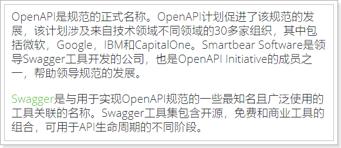
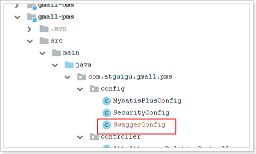
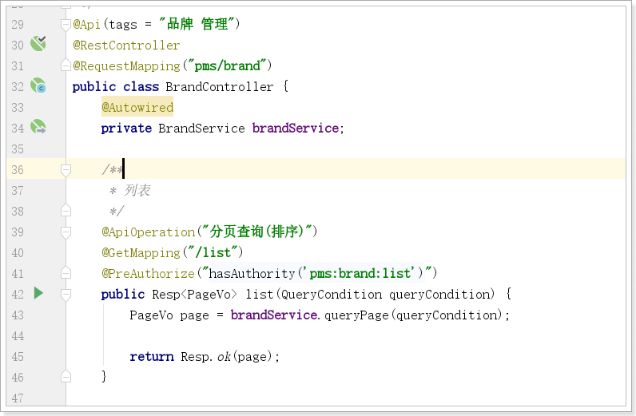
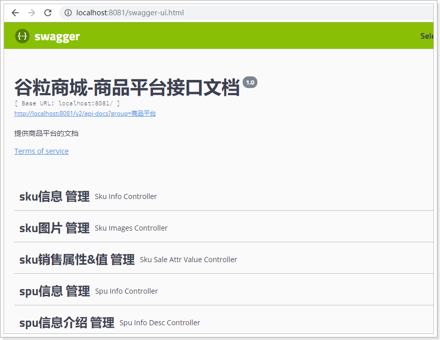

#  Swagger-UI

## 1.  什么是OpenAPI

随着互联网技术的发展，现在的网站架构基本都由原来的后端渲染，变成了：前端渲染、前后端分离的形态，而且前端技术和后端技术在各自的道路上越走越远。  前端和后端的唯一联系，变成了API接口；API文档变成了前后端开发人员联系的纽带，变得越来越重要。

没有API文档工具之前，大家都是手写API文档的，在什么地方书写的都有，而且API文档没有统一规范和格式，每个公司都不一样。这无疑给开发带来了灾难。

OpenAPI规范（OpenAPI Specification 简称OAS）是Linux基金会的一个项目，试图通过定义一种用来描述API格式或API定义的语言，来规范RESTful服务开发过程。目前V3.0版本的OpenAPI规范已经发布并开源在github上 。

官网：https://github.com/OAI/OpenAPI-Specification

## 2.   什么是swagger？

OpenAPI是一个编写API文档的规范，然而如果手动去编写OpenAPI规范的文档，是非常麻烦的。而Swagger就是一个实现了OpenAPI规范的工具集。

官网：https://swagger.io/

看官方的说明：

 

Swagger包含的工具集：

- **Swagger编辑器：** Swagger Editor允许您在浏览器中编辑YAML中的OpenAPI规范并实时预览文档。
- **Swagger UI：** Swagger UI是HTML，Javascript和CSS资产的集合，可以从符合OAS标准的API动态生成漂亮的文档。
- **Swagger Codegen：**允许根据OpenAPI规范自动生成API客户端库（SDK生成），服务器存根和文档。
- **Swagger Parser：**用于解析来自Java的OpenAPI定义的独立库
- **Swagger Core：**与Java相关的库，用于创建，使用和使用OpenAPI定义
- **Swagger Inspector（免费）：** API测试工具，可让您验证您的API并从现有API生成OpenAPI定义
- **SwaggerHub（免费和商业）：** API设计和文档，为使用OpenAPI的团队构建。


## 3.   快速入门

SpringBoot已经集成了Swagger，使用简单注解即可生成swagger的API文档。

### 3.1.   引入依赖

```xml
<dependency>
    <groupId>io.springfox</groupId>
    <artifactId>springfox-swagger2</artifactId>
    <version>2.9.2</version>
</dependency>
<dependency>
    <groupId>io.springfox</groupId>
    <artifactId>springfox-swagger-ui</artifactId>
    <version>2.9.2</version>
</dependency>
```


### 3.2.   编写配置

 

```java
@Configuration
@EnableSwagger2 // 加载引导类上或者配置类上都可以
public class SwaggerConfig {

    @Bean("商品平台")
    public Docket userApis() {
        return new Docket(DocumentationType.SWAGGER_2)
                .groupName("商品平台")
                .select()
                .apis(RequestHandlerSelectors.withClassAnnotation(Api.class)) // 所有标了API注解的才在文档中展示
                .paths(PathSelectors.regex("/pms.*")) // pms下的所有请求
                .build()
                .apiInfo(apiInfo())
                .enable(true);
    }

    private ApiInfo apiInfo() {
        return new ApiInfoBuilder()
                .title("谷粒商城-商品平台接口文档")
                .description("提供商品平台的文档")
                .termsOfServiceUrl("http://www.atguigu.com/")
                .version("1.0")
                .build();
    }

}
```


### 3.3.   接口声明



常用注解说明：

```java
/**
 @Api：修饰整个类，描述Controller的作用
 @ApiOperation：描述一个类的一个方法，或者说一个接口
 @ApiParam：单个参数描述
 @ApiModel：用对象来接收参数
 @ApiProperty：用对象接收参数时，描述对象的一个字段
 @ApiResponse：HTTP响应其中1个描述
 @ApiResponses：HTTP响应整体描述
 @ApiIgnore：使用该注解忽略这个API
 @ApiError ：发生错误返回的信息
 @ApiImplicitParam：一个请求参数
 @ApiImplicitParams：多个请求参数
 */
```


### 3.4.   启动测试

启动服务，然后访问：http://localhost:8081/swagger-ui.html




## 4.   所有工程添加swagger配置

