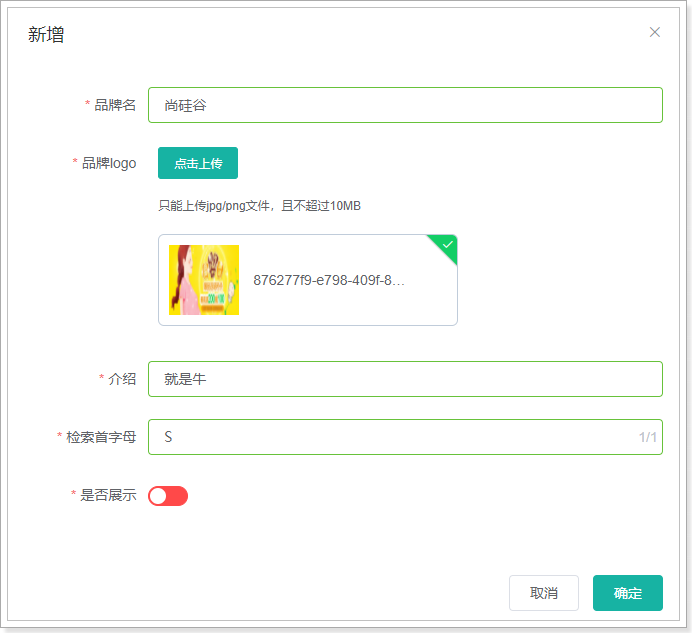
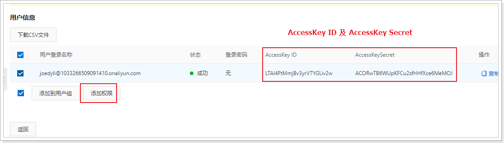
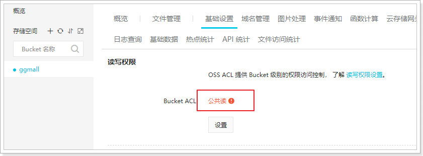

# 图片上传

这里使用阿里云对象存储（OSS）

官方文档：https://help.aliyun.com/document_detail/64041.html?spm=5176.87240.400427.54.1bfd4614VN7fDp

我们之前采用sdk的方式，图片-->后台服务器-->阿里云。

这样后台服务器面临并发压力，既然是上传给阿里云，可不可以直接传给阿里云服务器。

上传成功后，只需要给我一个图片地址保存到数据库即可。

查看官方文档，发现提供了浏览器直接上传到阿里云的参考文档：


## 1.   阿里云配置

登录到个人阿里云控制台，并创建bucket。


找到`基础设置`-->`跨域设置`


点击`设置`-->`创建规则`-->如下填写表单-->点击`确定`


## 2.   服务端签名后直传


用户发送请求到应用服务端，服务端怎么返回policy和签名？

官方文档再往下翻，有java示例：


点进去就有示例代码：


## 3.   编写代码实现签名获取


请求路径：/pms/oss/policy

请求方式：GET

请求参数：无

响应数据：统一都是Resp对象


### 3.1.   导入OSS的依赖

```xml
<dependency>
    <groupId>com.aliyun.oss</groupId>
    <artifactId>aliyun-sdk-oss</artifactId>
    <version>3.5.0</version>
</dependency>
```


### 3.2.   编写Controller方法

```java
@RequestMapping("pms/oss")
@RestController
public class PmsOssController {

    String accessId = "LTAI4FtMmjBv3yrV7YGLiv2w"; // 请填写您的AccessKeyId。
    String accessKey = "ACORwTB6WUpKFCu2sfHHfXce6MeMOJ"; // 请填写您的AccessKeySecret。
    String endpoint = "oss-cn-shanghai.aliyuncs.com"; // 请填写您的 endpoint。
    String bucket = "ggmall"; // 请填写您的 bucketname 。
    String host = "https://" + bucket + "." + endpoint; // host的格式为 bucketname.endpoint
    // callbackUrl为 上传回调服务器的URL，请将下面的IP和Port配置为您自己的真实信息。
    //String callbackUrl = "http://88.88.88.88:8888";
    // 图片目录，每天一个目录
    SimpleDateFormat sdf = new SimpleDateFormat("yyyy-MM-dd");
    String dir = sdf.format(new Date()); // 用户上传文件时指定的前缀。

    @GetMapping("policy")
    public Resp<Object> policy() throws UnsupportedEncodingException {

        OSSClient client = new OSSClient(endpoint, accessId, accessKey);

        long expireTime = 30;
        long expireEndTime = System.currentTimeMillis() + expireTime * 1000;
        Date expiration = new Date(expireEndTime);
        PolicyConditions policyConds = new PolicyConditions();
        policyConds.addConditionItem(PolicyConditions.COND_CONTENT_LENGTH_RANGE, 0, 1048576000);
        policyConds.addConditionItem(MatchMode.StartWith, PolicyConditions.COND_KEY, dir);

        String postPolicy = client.generatePostPolicy(expiration, policyConds);
        byte[] binaryData = postPolicy.getBytes("utf-8");
        String encodedPolicy = BinaryUtil.toBase64String(binaryData);
        String postSignature = client.calculatePostSignature(postPolicy);

        Map<String, String> respMap = new LinkedHashMap<String, String>();
        respMap.put("accessid", accessId);
        respMap.put("policy", encodedPolicy);
        respMap.put("signature", postSignature);
        respMap.put("dir", dir);
        respMap.put("host", host);
        respMap.put("expire", String.valueOf(expireEndTime / 1000));
        // respMap.put("expire", formatISO8601Date(expiration));

        return Resp.ok(respMap);
    }
}
```


### 3.3.   上传测试

 


## 4.   参数获取

### 4.1.   AccessKeyID及AccessKeySecret


选择用户，添加权限：



选择OSS所有权限


完成权限的添加


### 4.2.   bucktName及EndPoint


### 4.3.   公共读权限

为了方便回显，需要把读写权限改为公共读




