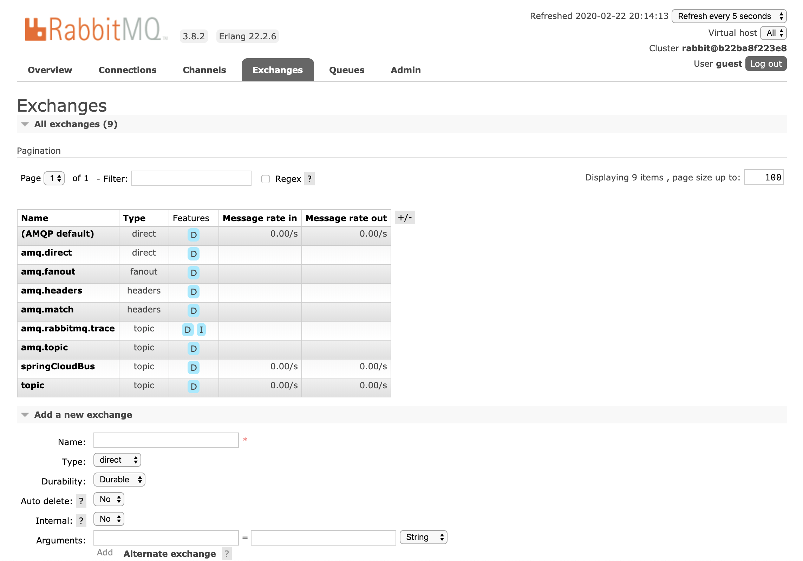

# RabbitMQ

https://github.com/rabbitmq

## 使用场景

异步消息发送

应用程序接偶

流量削峰

## 介绍

​		由 Erlang 语言开发的 AMQP 的开源实现，遵循AMQP :Advanced Message Queue，高级消息队列协议

## 特点

​		RabbitMQ 最初起源于金融系统，用于在分布式系统中存储转发消息，在易用性、扩展 性、高可用性等方面表现不俗。

   1.可靠性(Reliability)
 	RabbitMQ 使用一些机制来保证可靠性，如持久化、传输确认、发布确认。 

​	2.灵活的路由(Flexible Routing)

​	在消息进入队列之前，通过 Exchange 来路由消息的。对于典型的路由功能，RabbitMQ 已经提供了一些内置的 Exchange 来实现。针对更复杂的路由功能，可以将多个 Exchange 绑定在一起，也通过插件机制实现自己的 Exchange 。

​	3.消息集群(Clustering)

​	多个 RabbitMQ 服务器可以组成一个集群，形成一个逻辑 Broker 。

​	4.高可用(Highly Available Queues)

​	队列可以在集群中的机器上进行镜像，使得在部分节点出问题的情况下队列仍然可用。

​	5.多种协议(Multi-protocol)

RabbitMQ 支持多种消息队列协议，比如 STOMP、MQTT 等等。

​	6.多语言客户端(Many Clients)

RabbitMQ 几乎支持所有常用语言，比如 Java、.NET、Ruby 等等。

​	7.管理界面(Management UI)

​	RabbitMQ 提供了一个易用的用户界面，使得用户可以监控和管理消息 Broker 的许多方 面。

​	8.跟踪机制(Tracing)
 	如果消息异常，RabbitMQ 提供了消息跟踪机制，使用者可以找出发生了什么。 9.插件机制(Plugin System)RabbitMQ 提供了许多插件，来从多方面进行扩展，也可以编写自己的插件。

## 架构图

需要官网架构图

## 概念

### RabbitMQ Server:

​		也叫broker server，它是一种传输服务。 他的角色就是维护一条

从Producer到Consumer的路线，保证数据能够按照指定的方式进行传输。

### Producer

​	 消息生产者，如图A、B、C，数据的发送方。消息生产者连接RabbitMQ服

务器然后将消息投递到Exchange。 Consumer:消息消费者，如图1、2、3，数据的接收方。消息消费者订阅队列，

### RabbitMQ

​		将Queue中的消息发送到消息消费者。

Exchange:生产者将消息发送到Exchange(交换器)，由Exchange将消息路由到一个 或多个Queue中(或者丢弃)。Exchange并不存储消息。RabbitMQ中的Exchange有 direct、fanout、topic、headers四种类型，每种类型对应不同的路由规则。

### Queue:(队列)

​		是RabbitMQ的内部对象，用于存储消息。消息消费者就是通过订阅 队列来获取消息的，RabbitMQ中的消息都只能存储在Queue中，生产者生产消息并最终 投递到Queue中，消费者可以从Queue中获取消息并消费。多个消费者可以订阅同一个 Queue，这时Queue中的消息会被平均分摊给多个消费者进行处理，而不是每个消费者 都收到所有的消息并处理。

### RoutingKey

​		生产者在将消息发送给Exchange的时候，一般会指定一个routing key， 来指定这个消息的路由规则，而这个routing key需要与Exchange Type及binding key联 合使用才能最终生效。在Exchange Type与binding key固定的情况下(在正常使用时一 般这些内容都是固定配置好的)，我们的生产者就可以在发送消息给Exchange时，通过 指定routing key来决定消息流向哪里。RabbitMQ为routing key设定的长度限制为255 bytes。

### Connection: (连接):

​		Producer和Consumer都是通过TCP连接到RabbitMQ Server 的。以后我们可以看到，程序的起始处就是建立这个TCP连接。

### Channels: (信道)

​		它建立在上述的TCP连接中。数据流动都是在Channel中进行 的。也就是说，一般情况是程序起始建立TCP连接，第二步就是建立这个Channel。

### VirtualHost

 	权限控制的基本单位，一个VirtualHost里面有若干Exchange和 MessageQueue，以及指定被哪些user使用

## 模式

### 直连模式Direct(自带负载均很)

​		任何发送到Direct Exchange的消息都会被转发到RouteKey中制定的Queue

​	一般情况下可以使用rabbitMQ自带的Exchange “”。该交换器的名字为空字符串，default Exchange

这种模式下不需要讲Exchange进行任何绑定操作

消息传递时需要一个RouteKey 可以简单的理解为要发送的队列名字

如果vhost中不存在RouteKey中指定的队列名，则该消息会被抛弃

### 分列模式(Fanout)

任何发送到Fanout Exchange的消息都会被转发到与该Exchange绑定的多有QUeue上

1.可以理解为路由表模式

2.这种模式不需要RouteKey

3.这种模式需要提前将Exchange与Queue进行绑定，一个Exchange可以绑定多个Queue，一个Queue可以同多个Exchange进行绑定

4.如果接收到消息的Exchange没有与任何Queue绑定，则消息会被抛弃

### 主题模式(Topic)

1.这种模式比较复杂 每个队列都有其关心的主题，所有的消息都带有一个标题RouteKey Exchange会将消息转发到所有关注主题能与RouteKey模糊匹配的队列

2.这种模式需要RouteKey，也需要提前绑定Exchange与Queue

3.在进行绑定时，要提供一个该队列关心的主题，如#.log.#表示该队列关心的所有涉及log的消息

4.# 表示0或若干个关键字 “”表示一个关键字

5.同样，若果Exchange没有发现能够与RouteKey匹配的Queue，则会抛弃此消息


## 控制台

Durability:是否做持久化 Durable(持久) transient(临时) Auto delete : 是否自动删除



# FQA

```java
   Caused by: com.rabbitmq.client.ShutdownSignalException: channel error; protocol method: #method<channel.close>(reply-code=404, reply-text=NOT_FOUND - no queue 'draven' in vhost '/', class-id=50, method-id=10)
  
不存在此消息队列
```

