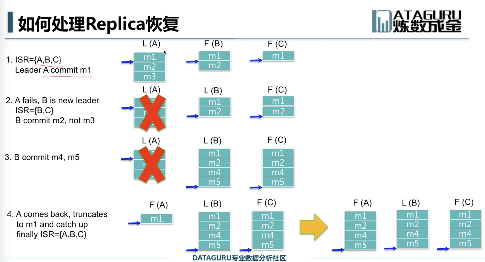
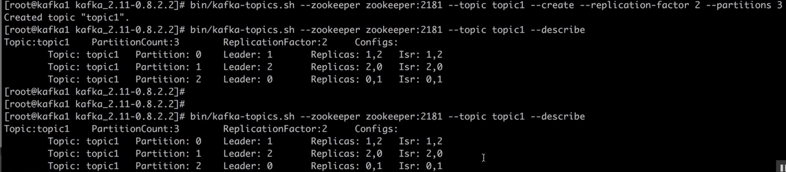

# Kafka


高吞吐率 100万/s

消息持久化 所有消息均被持久化到磁盘 无消息丢失 支持消息重放

完全分布式  Producer Broker Consumer

同时满足适应在线流处理和离线批处理


replication 4 > available brokers3 error


# 高性能

## 高效使用磁盘

1.高效使用磁盘

顺序写磁盘

2.Append Only

3.充分利用Page Cache

4.支持多Directory（可使用多Drive）

## 零拷贝

## 批处理和压缩

## Partition

## ISR

实现了可用性和一致性的动态平衡


# 环境搭建


## zookeeper

参考文档 http://zookeeper.apacher.org/doc/r3.4.9/zookeeperStarted.html

### Kafka


## 传统部署

# Docker

## 低版本部署


### zookeeper

```shell
FROM centos:6.6

RUN yum -y install vim lsof wget tar bzip2 unzip vim-enhanced passwd sudo yum-utils hostname net-tools rsync man git make automake cmake patch logrotate python-devel libpng-devel libjpeg-devel pwgen python-pip

RUN mkdir /opt/java &&\
   wget --no-check-certificate --no-cookies --header "Cookie: oraclelicense=accept-securebackup-cookie" http://download.oracle.com/otn-pub/java/jdk/8u102-b14/jdk-8u102-linux-x64.tar.gz -P /opt/java

RUN tar zxvf /opt/java/jdk-8u102-linux-x64.tar.gz -C /opt/java &&\
   JAVA_HOME=/opt/java/jdk1.8.0_102 &&\
   sed -i "/^PATH/i export JAVA_HOME=$JAVA_HOME" /root/.bash_profile &&\
   sed -i "s%^PATH.*$%&:$JAVA_HOME/bin%g" /root/.bash_profile &&\
   source /root/.bash_profile

ENV ZOOKEEPER_VERSION "3.4.6"

RUN mkdir /opt/zookeeper &&\
   wget http://mirror.olnevhost.net/pub/apache/zookeeper/zookeeper-$ZOOKEEPER_VERSION/zookeeper-$ZOOKEEPER_VERSION.tar.gz -P /opt/zookeeper

RUN tar zxvf /opt/zookeeper/zookeeper*.tar.gz -C /opt/zookeeper

RUN echo "source /root/.bash_profile" > /opt/zookeeper/start.sh &&\
   echo "cp /opt/zookeeper/zookeeper-"$ZOOKEEPER_VERSION"/conf/zoo_sample.cfg /opt/zookeeper/zookeeper-"$ZOOKEEPER_VERSION"/conf/zoo.cfg" >> /opt/zookeeper/start.sh &&\
   echo "/opt/zookeeper/zookeeper-$"ZOOKEEPER_VERSION"/bin/zkServer.sh start-foreground" >> /opt/zookeeper/start.sh

EXPOSE 2181

ENTRYPOINT ["sh", "/opt/zookeeper/start.sh"]
```

### kafka

```shell
FROM centos:6.6

ENV KAFKA_VERSION "0.8.2.2"

RUN yum -y install vim lsof wget tar bzip2 unzip vim-enhanced passwd sudo yum-utils hostname net-tools rsync man git make automake cmake patch logrotate python-devel libpng-devel libjpeg-devel pwgen python-pip

RUN mkdir /opt/java &&\
	wget --no-check-certificate --no-cookies --header "Cookie: oraclelicense=accept-securebackup-cookie" http://download.oracle.com/otn-pub/java/jdk/8u102-b14/jdk-8u102-linux-x64.tar.gz -P /opt/java

RUN mkdir /opt/kafka &&\
	wget http://apache.fayea.com/kafka/$KAFKA_VERSION/kafka_2.11-$KAFKA_VERSION.tgz -P /opt/kafka

RUN tar zxvf /opt/java/jdk-8u102-linux-x64.tar.gz -C /opt/java &&\
	JAVA_HOME=/opt/java/jdk1.8.0_102 &&\
	sed -i "/^PATH/i export JAVA_HOME=$JAVA_HOME" /root/.bash_profile &&\
	sed -i "s%^PATH.*$%&:$JAVA_HOME/bin%g" /root/.bash_profile &&\
	source /root/.bash_profile

RUN tar zxvf /opt/kafka/kafka*.tgz -C /opt/kafka &&\
	sed -i 's/num.partitions.*$/num.partitions=3/g' /opt/kafka/kafka_2.11-$KAFKA_VERSION/config/server.properties

RUN echo "source /root/.bash_profile" > /opt/kafka/start.sh &&\
	echo "cd /opt/kafka/kafka_2.11-"$KAFKA_VERSION >> /opt/kafka/start.sh &&\
	echo "sed -i 's%zookeeper.connect=.*$%zookeeper.connect=zookeeper:2181%g'  /opt/kafka/kafka_2.11-"$KAFKA_VERSION"/config/server.properties" >> /opt/kafka/start.sh &&\
	echo "bin/kafka-server-start.sh config/server.properties" >> /opt/kafka/start.sh &&\
	chmod a+x /opt/kafka/start.sh

EXPOSE 9092

ENTRYPOINT ["sh", "/opt/kafka/start.sh"]
```

```shell
docker run -itd --name zookeeper -h zookeeper -p 2181:2181 imagesName

docker run -idt --name kafka -h kafka -p9092:9092 --link zookeeper imagesName

lsof -i:port


# 测试语句

# 数据同步 outputtopic
```


# 监控

https://github.com/habren/kafaka-docker


# 架构

如何建立关系 0.8之前依赖于zookeeper

## Producer

1.主动触发 刷新broker信息 

2.周期性的

## Broker 


## Consumer 

如何建立关系

pull 模式 consumer主动获取，根据实际处理能力消费消息

## Zookeeper


### Topic

同一个Topic的消息分布在一个


### Partition

过期策略 删除过期策略 删除一个或多个segment


## 配置文件

log.dirs=/xxx

### 解释说明

```shell
# 命名方式
*.index
*.log
```


# Partitioner

```java
// 策略
HashPartitioner
// key相同发送到同一个Broker

RoundRobinPartitioner
// 顺序
```


# 同步与异步

## Sync

低延迟

低吞吐率

无数据丢失

## Aync

高延迟

高吞吐率

可能会有数据丢失


# Replica

# 数据复制

面临问题

1.如何Propagate

2.何时commit

3.如何处理Replica恢复

4.如何处理Replica全部宕机

## Propagate

复制过程

leader->follower

follower保证leader挂了自己能及时对外提供服务


### ISR机制

Leader会维护一个与其基本保持同步的Replica列表 ISR

follower比leader落后太多，或超过一定时间未放弃数据复制请求 则Leader将其从ISR中移除

当ISR中所有Replica都想LEader发送ACK时，Leader即commit


## Commit

### commit策略

#### server配置

Replica.lag.time.max.ms=10000 # 移除超时时间

Replica.lag.max.messages=4000 # 存在落后条数

#### Topic配置

min.insync.replica=1

#### Producer配置

Request.required.acks=0

## Replica恢复




## Replica全部宕机

等待ISR中任一Replica恢复，并选它为Leader CP

1.等待时间较长

2.或ISR中的所有Replica都无法回复或者数据丢失，则该partition将永久不可用

选择第一个回复的Replica为新的Leader,无论它是否在ISR中 AP（默认配置）

1.并未包含所有已被之前Leader Commit过的消息，因此会造成消息丢失

2.可用性比较高


# kafka如何使用


# zookeeper

## 介绍

包含一个Leader，多个Follower

所有的follower都可提供服务

所写的擦欧哦都会被forward到Leader

Client与Server通过NIO通信

全局串行化所有的写操作

保证同一客户端的指令被FIFO执行

保证消息通知的FIFO

## Zab协议

### 广播模式

1.Leader将所有更新（proposal），顺序发送给follower

2.当leader收到半数以上的follower对此proposal的ACK时，向所有follower发送commit消息，并在本地commit该消息

3.Follower收到Proposal后即将该proposal写入磁盘，写入成功即返回ACK给Leader

4.每个Proposal都有一个唯一的单调递增proposal ID

### 恢复模式

进入恢复模式：当leader宕机或者丢失大多数follower后，即进入恢复模式

结束恢复模式：

恢复模式的意义：


# Cap理论

## Consistency

一致性

## Availablity

可用性 有限时间内返回合理的结果

## Partition tolerance

分区容忍性


cp强一致性 数据不一致 马上返回错误

ap保证可用 数据不一致时 保证返回结果


实例

CA

RDBMS

AP

Cassandra

CP

redis

## 一致性方案

## Master-slave

同步复制

异步复制

## WNR

P2P分布式

N代表赴本书 W代表每次读写要保证的最少些成功的副本数 R代表每次读至少读区的副本数

## Paxos

RAFT





# 参考资料

 http://www.jasongj.com
