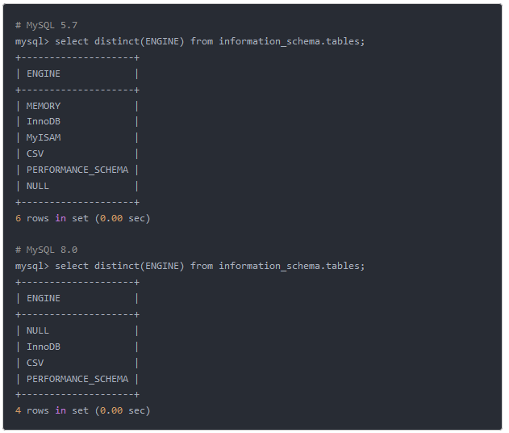
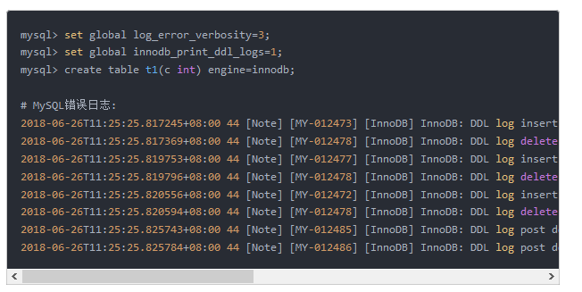

# Mysql

索引是帮助Mysql高效获取数据的排好序的数据结构

索引存储在文件里（data/database/）

http://www.cs.usfca.edu

https://www.cs.usfca.edu/~galles/visualization/

https://www.cs.usfca.edu/~galles/visualization/BPlusTree.html

## 索引结构

### 二叉树

单边增长现象（默认大的数据会插入右边）  索引递增时会出现问题


### 红黑树

自动平衡

优化思路

### Hash

精确定位

但是不能做范围查找

### Btree

### B+Tree

非叶子节点不存储data，只存储key  可以增大度

叶子结点不存储指针

顺序访问指针，提高区间访问的性能


说明：一次磁盘I/O越少越好

若h=1 时，数据量太大，一次加载耗费时间 耗费内存空间


mysql 的默认值是16k

```mysql
# 千万级别 建议分库分表
show global status like  'Innodb_page_size'
# result
'Innodb_page_size', '16384'
```

为什么会加入指针

为了做范围查找


存储引擎


# 实例分析

.frm 表结构

.MYD  数据行文件

.MYI index 索引文件


m：不保存索引（分离）

i：保存索引（同时） 辅助索引 两次查询


## MyISAM

存储于硬盘

frm

MYD

MYI

非聚集索引

MyISAM 索引文件和数据文件是分离的

key

value：key > 指针>存储行文件 


## InnoDB

表数据文件本身就是按B+Tree组织的一个索引结构文件


聚集索引-叶节点包含了完整的数据记录（主键为索引 来组织数据）


为什么InnoDB表必须有主键，并且推荐使用整型的自增主键？

串可能会 分列算法


为什非主键索引结构叶子节点存储的是主键值？（一致性 和 节省存储空间）

idb：索引文件和数据文件是合并的


聚集索引 与 非聚集索引

联合索引的底层存储结构是什么


# 补充知识点

1.离散性越高，选择性越好 --什么是离散性

2.最左匹配原则： 对索引的关键字进行计算 对比，一定是从左往右一次进行 且不可跳过

 于是引出---- 联合索引

  经常使用的列放至最左 最左匹配原则

  离散性越高，有限 

  宽度小的列有限 最小空间原则

3. 覆盖索引

   查询的列可以通过索引节点种的关键字直接返回，则该索引称之为 覆盖索引

   覆盖索引可以减少数据库IO ，随机IO变为顺序IO 可提高查询性能


# 慢查询分析

explain

| id   | table       | select_type | partitions | type | possible_keys | key  | key_len | ref  | rows | filtered | Extra |
| ---- | ----------- | ----------- | ---------- | ---- | ------------- | ---- | ------- | ---- | ---- | -------- | ----- |
| 1    | account_tbl | SIMPLE      | NULL       | ALL  | NULL          | NULL | NULL    | NULL | 2    | 100      | NULL  |

结果解析

```mysql
explain EXTENDED SELECT * FROM db_account.account_tbl;
show warnings;
# 会展示优化后的结果 给出适当的建议
```

 策略

```shell
# 最左前缀法则
# 联合索引 不能跳过前面的索引
```

| id                             | select_type            | table                                      | partitions                              | type                                                         | possible_keys | key                        | key_len                                                      | ref                             | rows | filtered | Extra           |
| ------------------------------ | ---------------------- | ------------------------------------------ | --------------------------------------- | ------------------------------------------------------------ | ------------- | -------------------------- | ------------------------------------------------------------ | ------------------------------- | ---- | -------- | --------------- |
| 1                              | SIMPLE                 | account_tbl                                | NULL                                    | ALL                                                          | NULL          | NULL                       | NULL                                                         | NULL                            | 2    | 100      | NULL            |
| select 序列号                  | primary:主查询：结果集 | system:const特例                           | 可能会用到索引                          | 会用到索引                                                   | 索引长度      | 关联的是另一个表的那个字段 | using index: 查询的列被索引覆盖     性能高的表现             |                                 |      |          |                 |
| id值越大 优先执行              |                        |                                            | const:唯一索引或unique key 查询的结果集 |                                                              |               |                            | using where:查询的列     未被索引覆盖     where筛选条件非索引的前导列 |                                 |      |          |                 |
| id相同  从上到下，null最后执行 |                        | eq_ref:主键或唯一索引连接 最多只会返回一条 |                                         |                                                              |               | usring where;using index   |                                                              |                                 |      |          |                 |
|                                |                        |                                            |                                         | ref:不使用唯一索引，而是使用普通索引或者唯一索引的部分前缀     索引要和某个值比较，kennel会找到多个符合的行数 |               |                            |                                                              |                                 |      |          | using temporary |
|                                |                        |                                            |                                         | range:范围查询时 in between < >  >=                          |               |                            |                                                              | using filesort:不是引用索引排序 |      |          |                 |
|                                |                        |                                            |                                         | index:全表索引扫面                                           |               |                            |                                                              |                                 |      |          |                 |
|                                |                        |                                            |                                         | ALL:全表扫面                                                 |               |                            |                                                              |                                 |      |          |                 |

# FQA


## 1.异常信息

### 1.1 连接异常

	--原因：需要配置时区，并且驱动也进行了调整

## 1.2 java.sql.SQLNonTransientConnectionException: Public Key Retrieval is not allowed

	--原因：
	
	--解决方案：&allowPublicKeyRetrieval=true

### 正确配置
```yaml
#datasource
spring:
	datasource:
    driver-class-name: com.mysql.cj.jdbc.Driver
    url: jdbc:mysql://127.0.0.1:3306/xxx?characterEncoding=utf8&serverTimezone=UTC&useSSL=false&allowPublicKeyRetrieval=true
    username: root
    password: root
    hikari:
      maximum-pool-size: 30
      minimum-idle: 10

# 低版本
spring:
  datasource:
    username: root
    password: 1234
    url: jdbc:mysql://localhost:3306/springboot?useUnicode=true&characterEncoding=utf-8&useSSL=true&serverTimezone=UTC
    driver-class-name: com.mysql.jdbc.Driver
```


# 8.0

## 特性集锦
 -来源 https://www.jianshu.com/p/be29467c2b0c

### 1. 默认字符集由latin1变为utf8mb4

在8.0版本之前，默认字符集为latin1，utf8指向的是utf8mb3，8.0版本默认字符集为utf8mb4，utf8默认指向的也是utf8mb4。

### 2. MyISAM系统表全部换成InnoDB表

系统表全部换成事务型的innodb表，默认的MySQL实例将不包含任何MyISAM表，除非手动创建MyISAM表。



### 3. 自增变量持久化
在8.0之前的版本，自增主键AUTO_INCREMENT的值如果大于max(primary key)+1，在MySQL重启后，会重置AUTO_INCREMENT=max(primary key)+1，

这种现象在某些情况下会导致业务主键冲突或者其他难以发现的问题。自增主键重启重置的问题很早就被发现(https://bugs.mysql.com/bug.php?

id=199)，一直到8.0才被解决，8.0版本将会对AUTO_INCREMENT值进行持久化，MySQL重启后，该值将不会改变。

#4. DDL原子化
--InnoDB表的DDL支持事务完整性，要么成功要么回滚，将DDL操作回滚日志写入到data dictionary 数据字典表 mysql.innodb_ddl_log 中用于回滚

操作，该表是隐藏的表，通过show tables无法看到。通过设置参数，可将ddl操作日志打印输出到mysql错误日志中。

mysql> set global log_error_verbosity=3;
mysql> set global innodb_print_ddl_logs=1;
mysql> create table t1(c int) engine=innodb;




# 安装配置

## 解压包安装

```mysql
mysqld --verbose --help


-- 1.下载压缩包
	 接搜索对应的版本即可
-- 2.配置环境变量
	-- mysqlpath为mysql安装目录
	export MYSQL_HOME=/mysqlpath
	export PATH=$PATH:$MYSQL_HOME/bin
	-- 测试环境变量是否生效
	 source .bash_profiles
-- 3.创建mysql用户(使用root)

-- 4.创建配置文件
	 -- my.cnf
-- 5.mysqld --initialize --console
   -- 请记录该文件目录下生成的密码
   -- y5vmO*lvOJeS
 
 
./mysqld --initialize --console
2020-11-15T12:21:45.656571Z 0 [System] [MY-013169] [Server] /Users/draven/Documents/java/soft/mysql/mysql8/mysql8/bin/mysqld (mysqld 8.0.22) initializing of server in progress as process 10212
2020-11-15T12:21:45.703506Z 0 [Warning] [MY-010159] [Server] Setting lower_case_table_names=2 because file system for /Users/draven/Documents/java/soft/mysql/mysql8/mysql8/data/ is case insensitive
2020-11-15T12:21:45.769340Z 1 [System] [MY-013576] [InnoDB] InnoDB initialization has started.
2020-11-15T12:21:46.144878Z 1 [System] [MY-013577] [InnoDB] InnoDB initialization has ended.
2020-11-15T12:21:47.019559Z 6 [Note] [MY-010454] [Server] A temporary password is generated for root@localhost: jlFFo1+wdij7
2020-11-15T12:21:47.911287Z 0 [System] [MY-013172] [Server] Received SHUTDOWN from user <via user signal>. Shutting down mysqld (Version: 8.0.22).


-- ./mysqld


Can't connect to local MySQL server through socket '/Users/draven/Documents/java/soft/mysql/mysql8/mysql.sock'


-- 卸载 删除当前 data 目录下所有数据


-- my.cnf

[mysqld]
# 设置3306端口
port=3306
  
# 设置mysql的安装目录
basedir=/Users/draven/Documents/java/soft/mysql/mysql8/mysql8
  
# 设置mysql数据库的数据的存放目录
datadir=/Users/draven/Documents/java/soft/mysql/mysql8/data8

#
socket=/Users/draven/Documents/java/soft/mysql/mysql8/mysql.sock

#
user=root


# 允许最大连接数
max_connections=200
  
# 允许连接失败的次数。这是为了防止有人从该主机试图攻击数据库系统
max_connect_errors=10
  
# 服务端使用的字符集默认为UTF8
character-set-server=utf8
  
# 创建新表时将使用的默认存储引擎
default-storage-engine=INNODB
  
# 默认使用“mysql_native_password”插件认证
default_authentication_plugin=mysql_native_password
  
[mysql]
# 设置mysql客户端默认字符集
default-character-set=utf8
  
[client]
# 设置mysql客户端连接服务端时默认使用的端口
port=3306
default-character-set=utf8

socket=/Users/draven/Documents/java/soft/mysql/mysql8/mysql.sock
```

