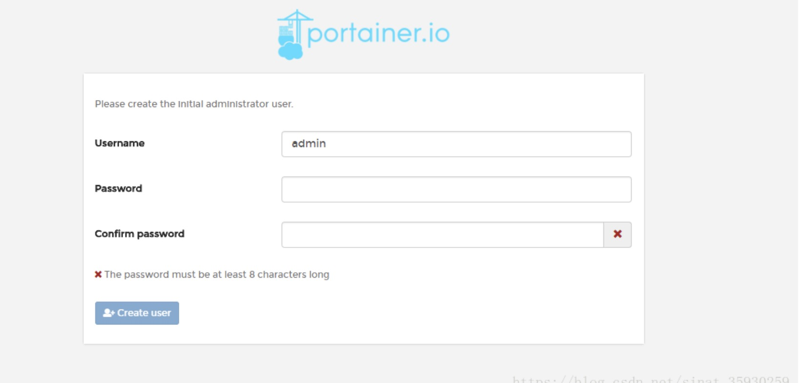
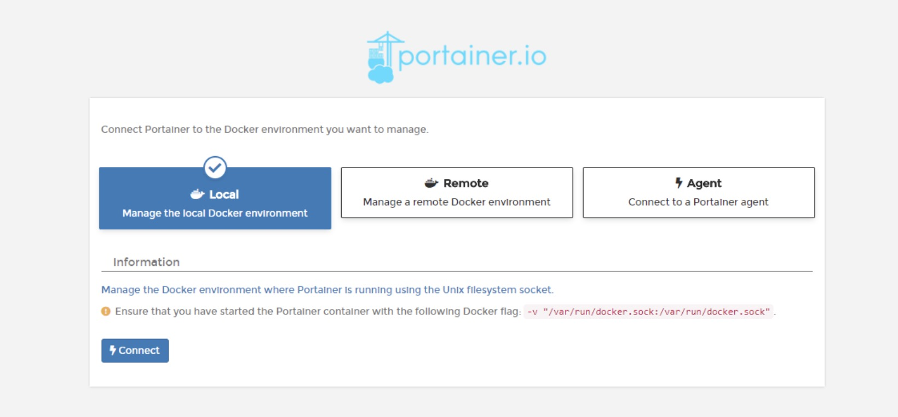
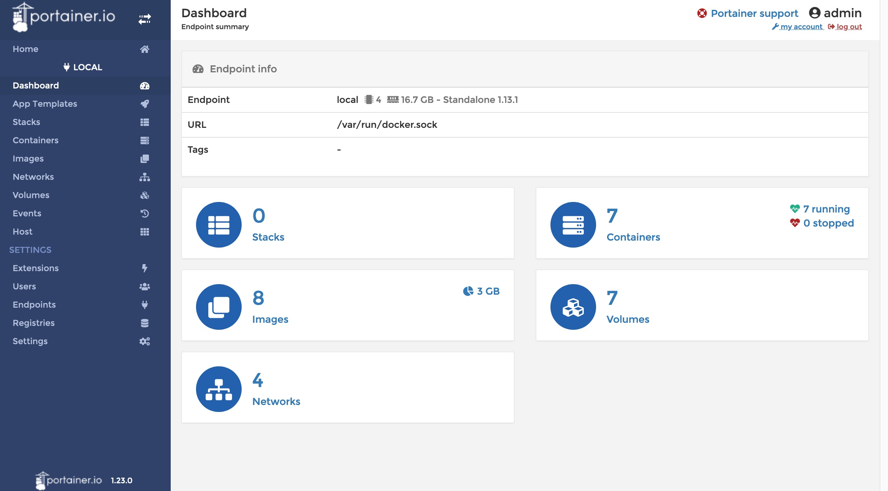

# Portainer

​	是一个开源、轻量级Docker管理用户界面，基于Docker API，可管理Docker主机或Swarm集群，支持最新版Docker和Swarm模式。

​	官方网址是：https://portainer.io/

## 创建卷

```
docker volume /docker/portainer/data
```

## 获取镜像

```shell
docker pull portainer/portainer:1.24.0
```

## 创建容器

```shell
docker run -d \
-p 9000:9000 \
--name portainer \
-v /var/run/docker.sock:/var/run/docker.sock \
-v /docker/portainer/data:/data \
portainer/portainer:1.24.0
```

访问页面

```shell
http://10.10.99.241:9000
```








