# Istio Gateway设计与技术

[TOC]

## Gateway简介

这里只是主要讲解Istio-Gateway。

在Istio中，Gateway控制着网格边缘的服务暴露。

**两个方向**

+ 网格外的服务访问k8s网格内部的服务，需要Istio的Gateway。
+ Istio的网格中默认不能访问外部服务的，如果要访问必须创建相应的规则，比如ServiceEntry来访问外部服务。但是访问外部服务不应要用Gateway，用Gateway只是为了服务治理。

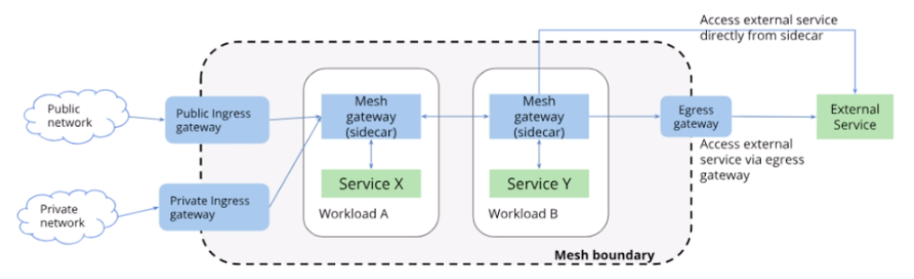

 Gateway 也是可以看做网格的负载均衡器，提供以下功能：

1、L4-L6的负载均衡

2、对外的mTLS	 

Istio服务网格中，Gateway可以部署任意多个，也是可以共用一个，也可以每个租户、namespaces单独隔离。

>Gateway可以用共用，也可以每个服务部署一个，但是为了隔离性更好  。

### Gateway配置规则

Istio 有个crd对象，叫Gateway，通过这个crd创建自己的Gateway。

配置介绍：

+ Servers

  Port 配置对应的端口协议

  Hosts 配置==外部访问==的域名比如：bookinfo.com，也是可以配置通配符`*`，任何域名访问。

  TLS 当前暴露的服务的TLS设置，图中是HTTPS所以要设置，如果是协议是HTTP则设置为空或者不设置。

  

Gateway只是定义虚拟的server，server 的路由需要通过VirtualService，VirtualService和Gateway绑定才能让整个服务生效。

+ Hosts 对应上面Gateway配置的域名
+ gateways 配置的上面对应Gateway名字
+ http 路由规则，通过match匹配对应URL在通过route路由到对应服务

### Gateway的流入流出

Gateway根据流入流出方向分为ingress gateway和engress gateway

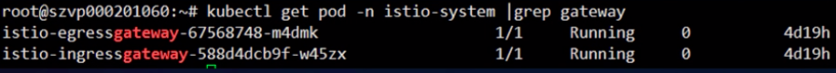

+ ingress gateway

  控制外部服务访问网格内服务，要配合VirtualService

+ engress gateway

  控制网格内服务访问外部服务，配合DestinationRule ServiceEntry使用

  > 其实我们访问外部服务也可以不用engress gateway，可以直接写地址访问，这里说为什么要用是因为本身服务所在的节点可能没有直接访问外网的权限	 这种情况需要engress gateway。或者需要更强大的服务治理功能。	 

## Gateway vs Kubernetes Ingress

Kubernetes Ingress是集群内的一种服务暴露方式，提供集群内访问入口，仅支持L7(http,https)负载均衡，功能单一，redis mongo都不支持

Istio1.0以前，利用Kubernetes Ingress实现网格内部服务暴露。

但是Ingress 无法实现很多功能：

1. L4-L6 tcp redis mongo 负载均衡

2. 对外mTLS 双向认证

3. SNI 的支持

4. 其他istio中已经实现的内部网络功能：Fault Injection，Traffic Shifting，Circuit Brreaking，Mirroring

   

**为了解决这些问题，Istio在1.0版本设计了新v1apha3API。**

出现自己的Gateway，相对Kubernetes Ingress呢出现如下好处：

+ Gateway允许管理员指定L4-L6的设置：端口及TLS设置。
+ 对于Ingress的L7设置，Istio允许VirtualService与Gateway绑定起来。
+ 为什么不把VirtualService与Gateway放在一起，分离的好处：用户可以像使用传统的负载均衡设备一样管理进入网格内部的流量，绑定虚拟IP到虚拟服务器上。便于传统技术用户无缝迁移到微服务。

## Gateway 原理及实现

Gateway也是通过服务发现的方式发现生成相应的规则，然后把相应的规则配置到Gateway上的。

**在Istio流程：**

​			Pilot通过Platform Adapter 适配器接管到Kubernetes或者Consul或者MCP这样平台的相应的Rule规则的增删改查，适配层对注册中心无感知。然后通过Aggergator Registry聚合层生成统一的接口调用，提供推送给ADS在IStio就是listener,route，classt endpoint,这里就是推送给的是Gateway。

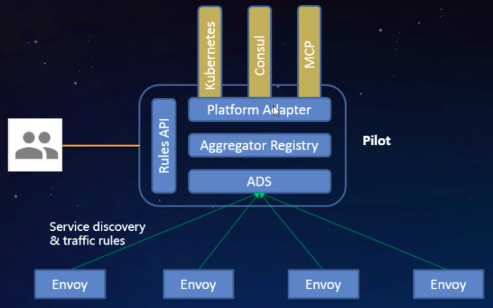

**在k8s的流程：**

​		用户通过kubectl 调用ApiServer 创建Service Pod，然后存储到etcd,然后Pilot通过Lsit/Watch 拿去到资源对象Service ,Endpoints,Pod CRDs转出相应的规则下发到Envoy。

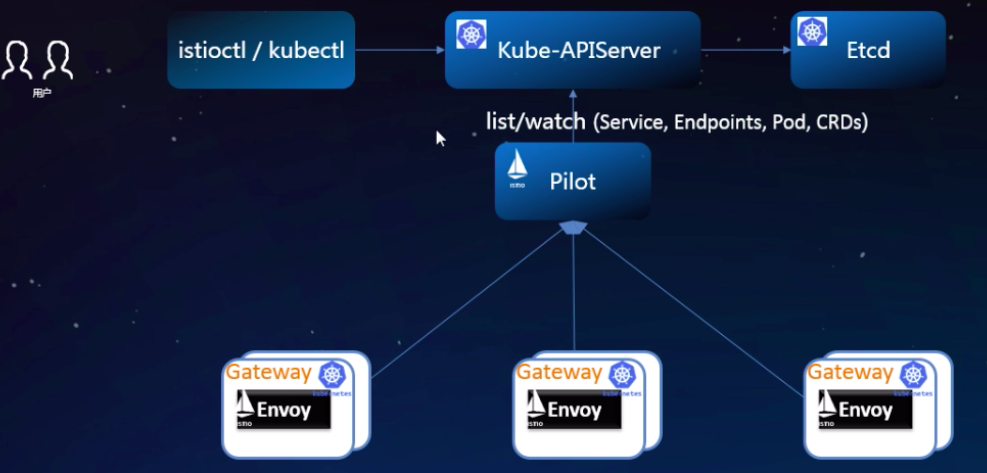

Gateway 与普通的sidecar 均是使用Envoy作为Proxy实现流量控制。Pilot为不同类型的Proxy生成相应的配置，Gateway的类型为router，sidecar的类型为sidecar。

Ingress Gateway 启动参数：

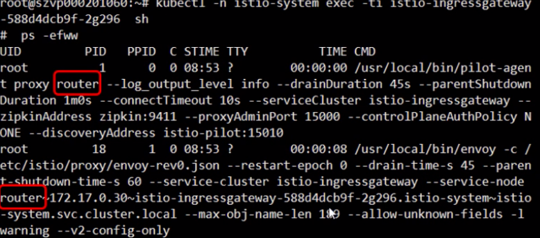

Sidecar 启动参数：

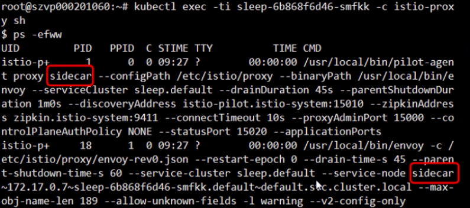

**Pilot 如何得知proxy类型？**

Envoy 发现服务使用的xDS协议，Envoy向server端pilot发起请求DiscoveryRequest时会携带自身信息node，nodey有一个ID标识，pilot会解析node标识获取proxy类型。

>在Istio中一共有三种类型：route，sidecar，ingress ，ingress和route是一种类型，ingress是历史遗留的类型。

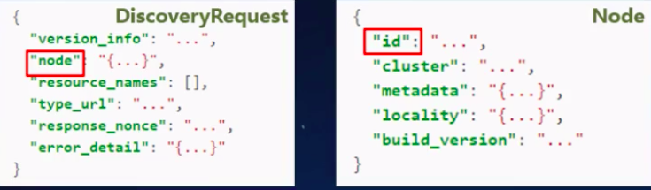

Envoy的节点标识可以通过静态配置文件制定，也可以通过启动参数 `--service-node`指定。

Gateway对象在Istio中是用CRD声明的，可以通过`$kubectl get crd gateways.networking,istio,io`验证。

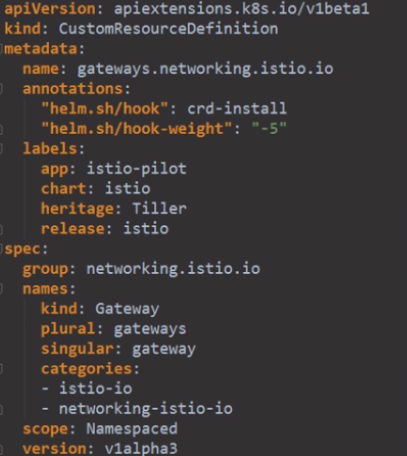

IStio networking所有配置API定义：

> 我表示这里并没有听太懂，所没有写🤔

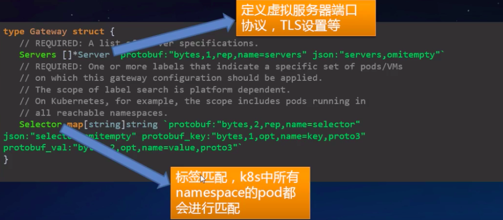

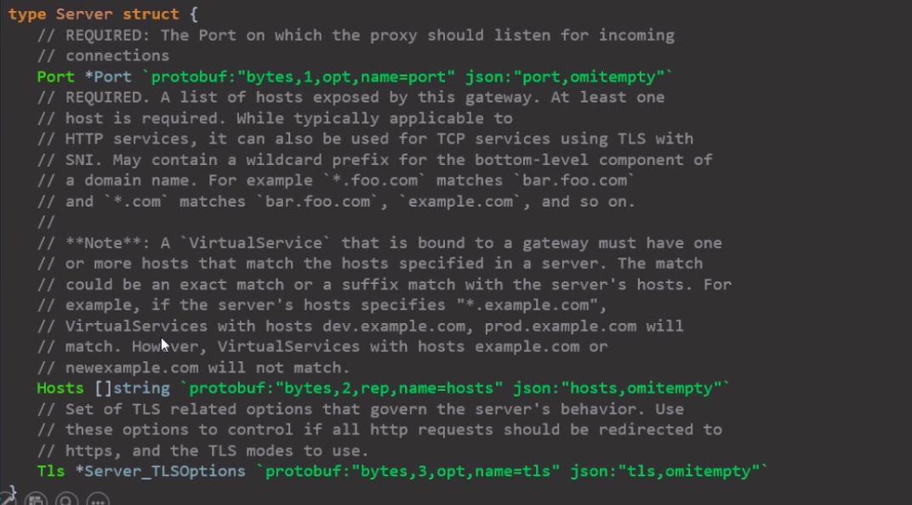

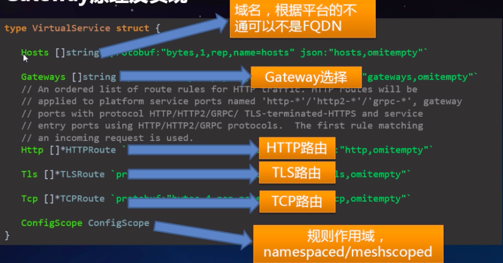

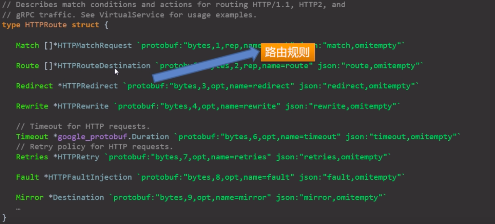

Gateway配置下发：

遵循make-before-break原则，电路的方式，配置下发先合并，杜绝规则更新过程出现503.

比如更新一个endpoint ,先把原先的endpoint保留，新endpoint推送到proxy之后才会干掉老的endpoint。

router类型与sidecar类型的proxy 最本质的区别是没有inbound cluster，endpoint，listener

这也从侧面证明Gateway不是流浪的终点只是充当一个代理转发。

## Gateway demo 演示

### 控制Ingress HTTP流量

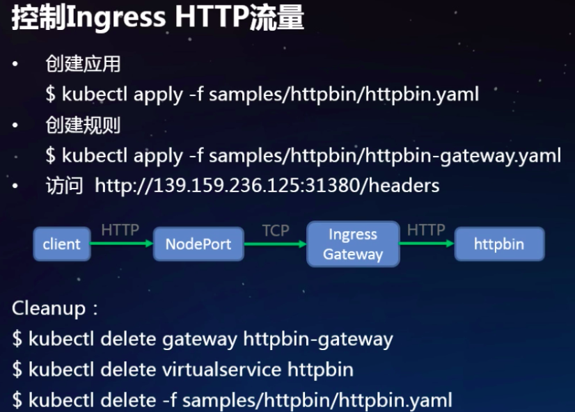

有一个httpbin服务外网访问不通，这是httpbin服务的service,因为在网格中直接访问

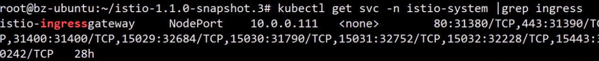

然后有一个gateway 配置如下：

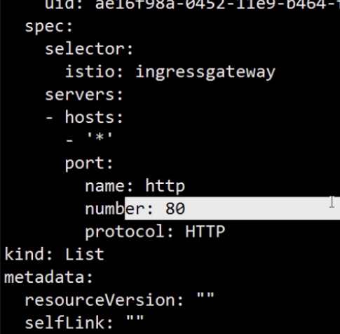

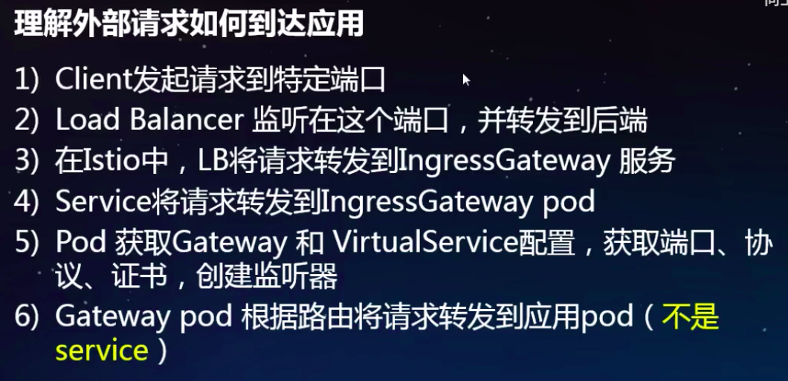

### 利用HTTPS保护后端服务

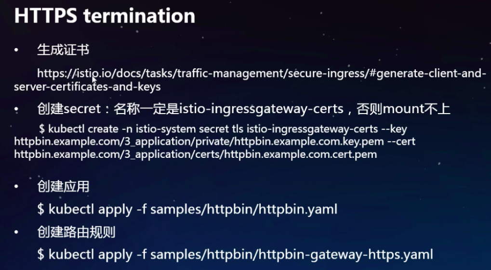

mode: SIMLE 是对客户端不验证

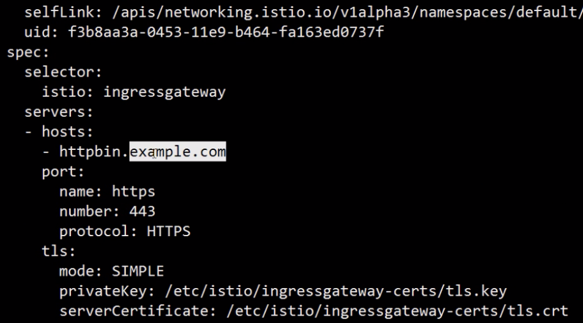

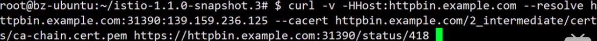

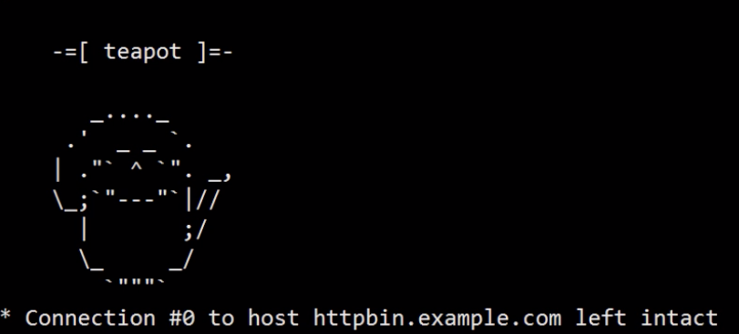

访问流向：客户端通过https请求到ingress 的NodePort，NodePort通过iptables规则转发到gateway的pod，gateway其实开启https的server，httpsServer监听请求，通过HTTP协议转发到httpbin的服务，处理完成httpbin返回到ingress，ingress再给客户端。

### mTLS 双向认证

验证客户端和服务端证书认证。

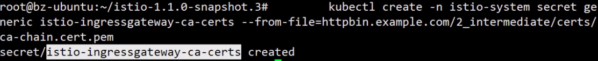

创建一个带双休认证的gateway

mtls.yaml

mode: MUTUAL 双向认证

通 cert.pem 认证客户端的证书

携带证书访问httpbin服务

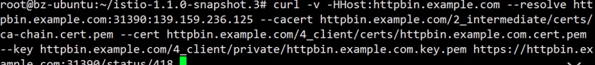

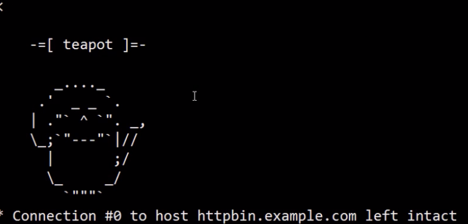

访问流向： 客户端携带key和ca,通过https发送请求到后端服务，后端服务实际被	ingress gateway做了转发，ingress gateway做个https双向认证，认证我们客户端的证书，认证成功建立https连接，实际ingress gateway和httpbin服务还是通过http的协议进行访问的。

### 控制egress流量，访问外部服务

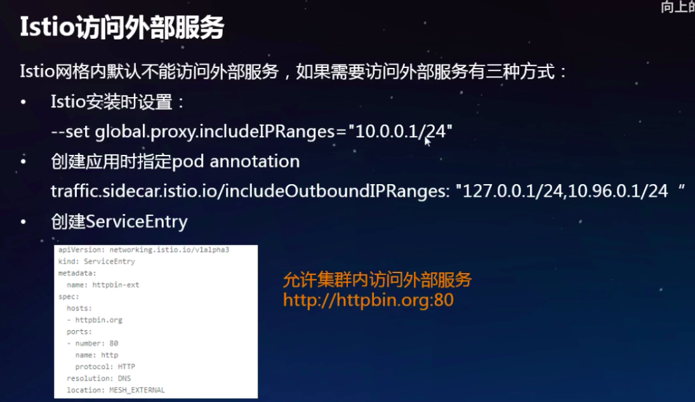

建立ServiceEntry 进行访问外部服务，服务网格中的pod可能没有直接访问外网的权限，只有ingressGateway所在pod有这种权限	，通过Gateway做一下代理的转发

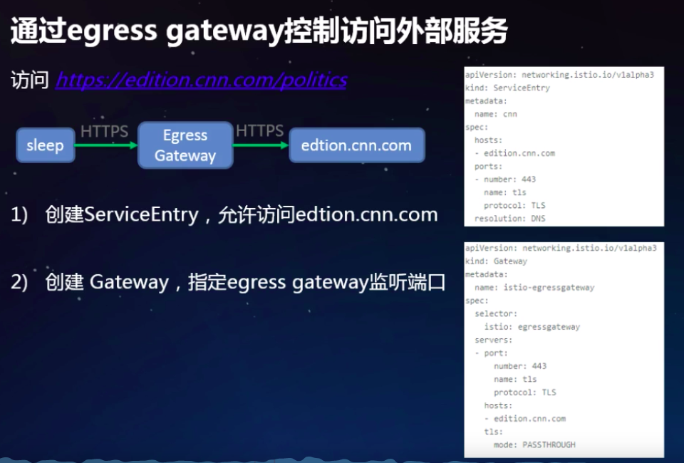

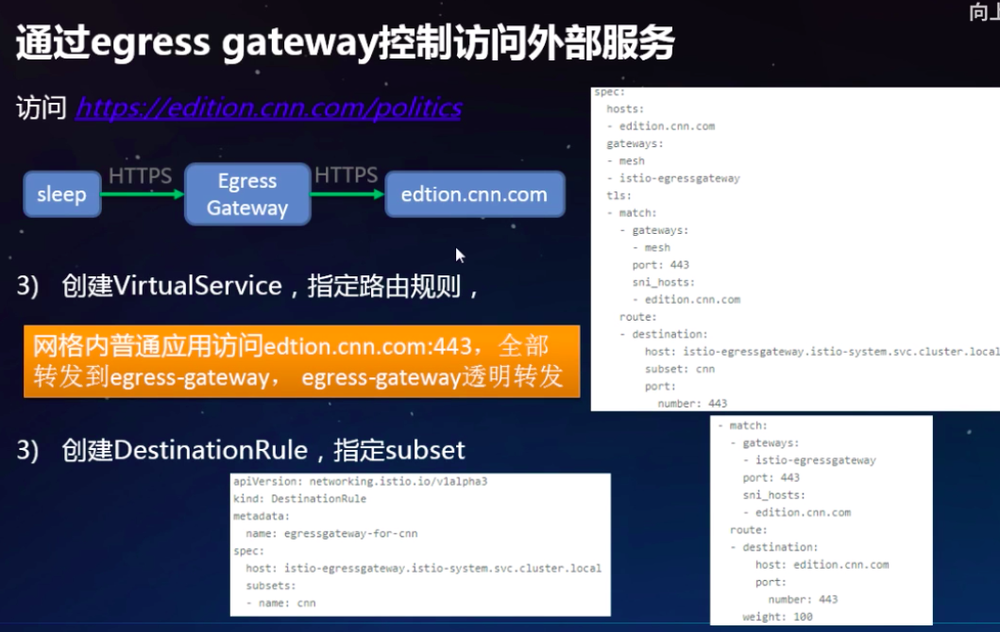

创建一个ServiceEntry

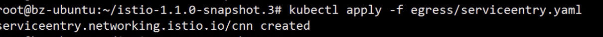

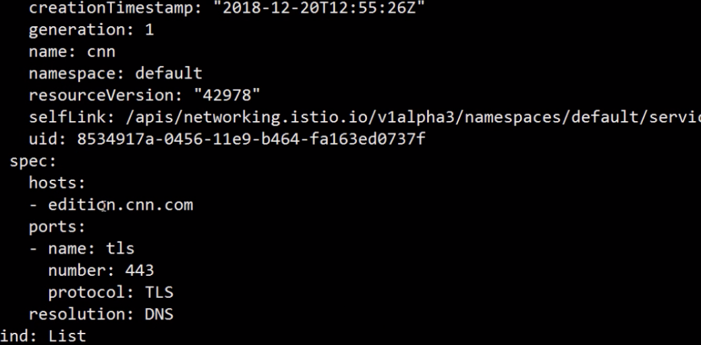

创建一个egress

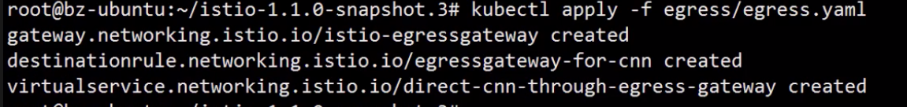

进入容器内部访问外部服务

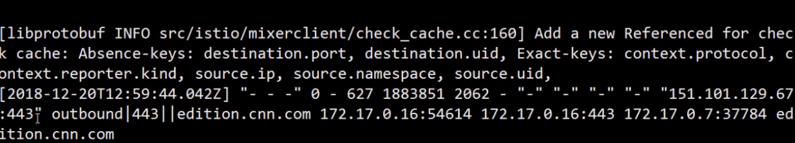
