#  Istio架构与原理

[TOC]

## Service Mesh

### Kubernetes

+ Kubernetes 提供云平台基础设施层强大容器编排与调度能力

  服务部署与弹性伸缩： Depoyment

  服务拆分与服务发现：Service

+ Kubernetes提供简单的负载均衡

  负载均衡：基于IPVS或者Iptables的简单均衡机制

在原始的时候一个应用跑到集群上，可能会把应用服务治理的逻辑写到代码里面，这样就会跟服务耦合在一起了，给开发带来麻烦，能不能把服务治理才分开放到SDK，比如SpringCloud，但在这样还是要放在应用里面。还是麻烦，能不能把服务的治理独立出来，出现了Service Mesh。

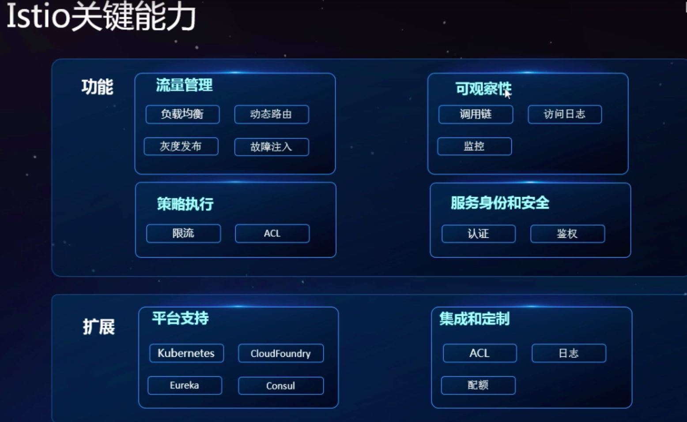

他可以在Kubernetes上完美的补气服务治理

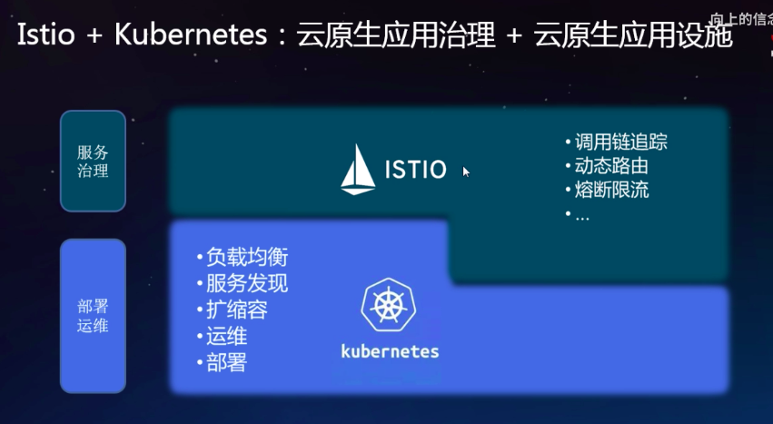

## Istio 架构基础

上面的是服务简称“数据面”，下面是“控制面”

Proxy 就是服务代理用的Envoy

Pilot 

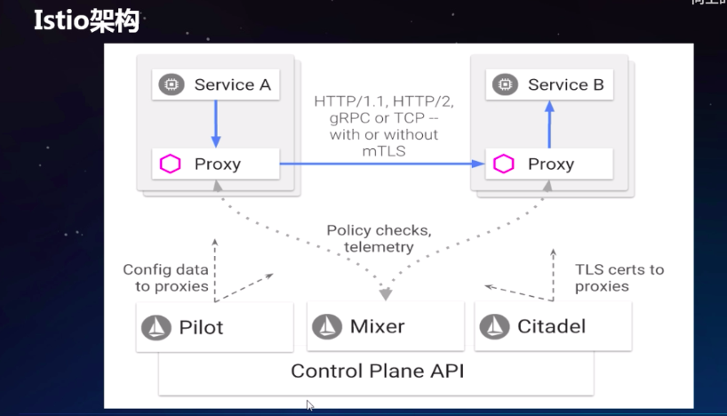

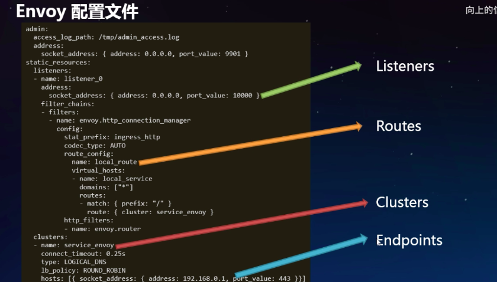

## Istio 基本概念

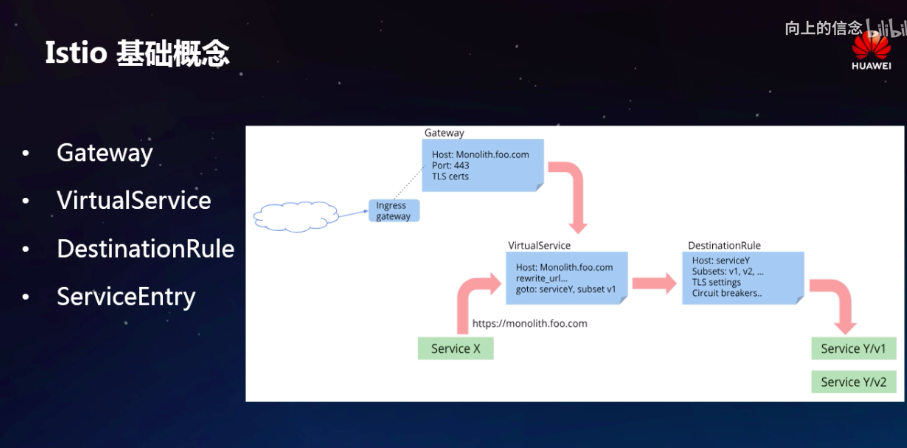

Gateway :服务网关转发到VitualService主要是根据我们的请求

，一个服务有三个版本v1v2v3根据条件转发到哪个版本，

VitualService把请求导入到某个v1版本之后这会就走到

DestinationRule主要工作是假设v1有三个副本负载均衡策略使用和最小连接的配置

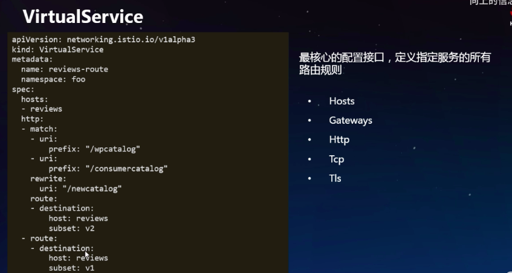

看图说话：VirtualService 功能有个服务叫reviews ,访问reviews的URL带“/wpcatlog”或者“/cosumercatlog”就是走match的route，而且会把URL重写成“/newcatalog”   然后导入到route的reviews:v2版本,没有则走默认的route 也就是reviews:v1版本

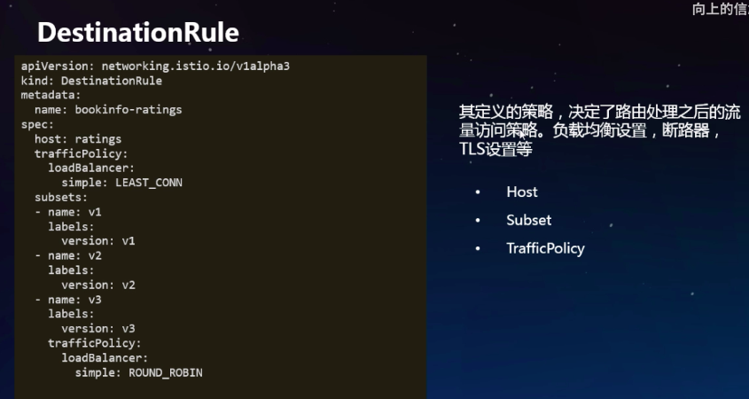

看图说话：DestinationRule 是在VirtualService导入指定服务的版本之后，进行一个实例副本数的负载，限流策略等。 trafficPolicy 是定义默认策略 LEAST_CONN 是最小连接，subsets 是指定哪些版本使用这个链接策略。图中v1v2 都是使用默认策略。二v3 里面有定义了一个trafficPolicy，策略是轮训。就近规则。

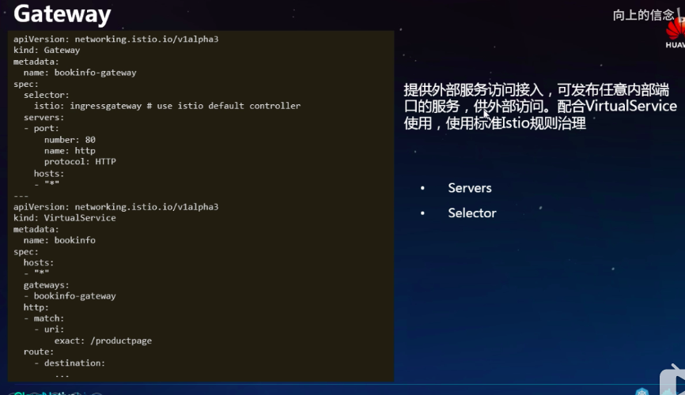

VirtualService里面绑定了Gateway,建立绑定关系

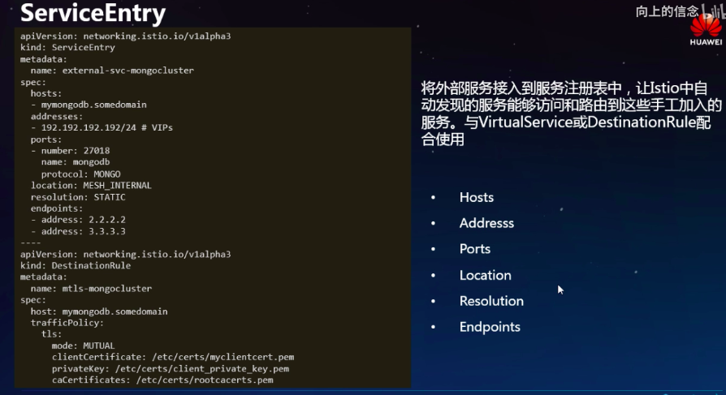

ServiceEntry 如果想访问外网也是需要建立这个东西

## Istio & Kubernetes ：架构结合

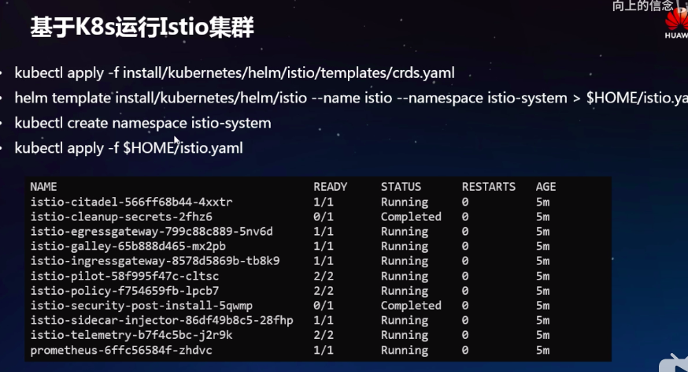

## 运行一个Istio集群

运行官方提供的bookinfo 例子，

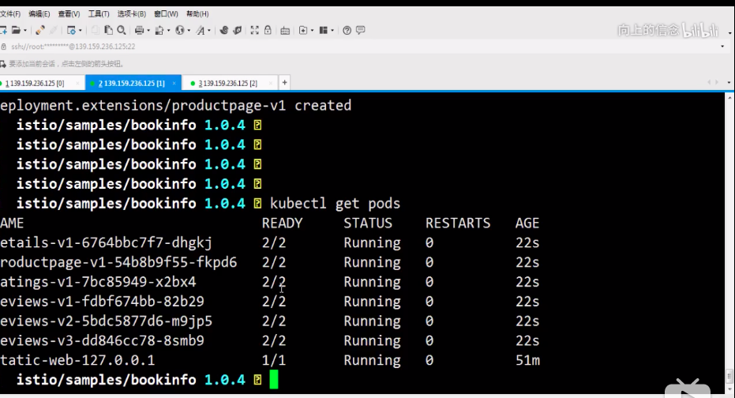

这个官方提供的bookinfo 应用，每个pod有两个实例，一个是应有，另一个就是`sidecar`。在刚创建的Init时候IPtables 那边做一些规则,然后通过`sidecar`带到了pod里面，通过规则把进出口的流量，都导到Envoy上
