# Istio灰度发布与技术实现

[TOC]

## 典型发布类型对比

+ 蓝绿发布
+ 灰度发布(金丝雀发布)
+ A/B测试

通过例子阐述三种类型的概念

 		在一个公司，一个程序员负责一部分工作，有一天他要调离这个岗位，这个时候主管招了一个新的员工负责他这部分工作，涉及到一个交接的过程。有下面几种情况：

​			主管会被交接者在同一时刻把所有工作都分配给新人，然后看新人是否胜任，如果可以的话，接下来所有工作由着新人来做。															——蓝绿发布

​			被交接者把一小部分工作，分配给新人，然后看效果，如果一切顺利会逐渐的把工作一部分一部分的全部分配给新人。																			——金丝雀发布

​			两个人同时分担一部分工作，然后主管邀请另外的主管或者组内的成员一起给这两个人打分，如同他们产出代码的质量和其他同事之间的关系， 各个维度评判这个两个人的输出。最后综合决策到底留下哪一个。        ——A/B测试

### 蓝绿发布

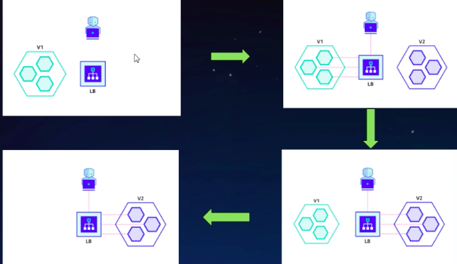

​			首先有个一个v1 版本，用户通过LB访问v1版本，如果要发布一个v2版本，可以通过LB全量切换流量到v2版本，如果v2版本没问题则v1下线。在这个工程中有个重点`全量切换`。缺点是如果v2版本有问题，就会影响到所有的用户。这个时候就引出 金丝雀发布。

### 金丝雀发布

>**金丝雀发布的由来：**矿工下井的时候会带上一只金丝雀，用来测试瓦斯的浓度，如果瓦斯浓度过高的话，金丝雀会首先感知到然后身亡。对矿工提到一个警示的作用，然后立刻逃生。

​	国外喜欢这种叫金丝雀发布，国内叫灰度发布指的是同一种发布形式。

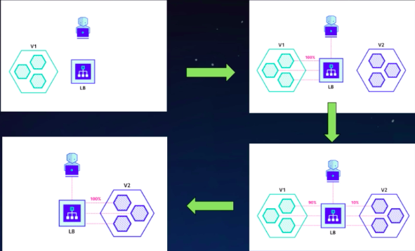

​	这张图中可以看出它是只导一部分流量给新的的版本v2，然后逐渐加大v2版本的流量，最终让v2版本到达100%的流量。最后下线v1版本。这是一种很平滑很谨慎的发布形式，渐进的一个过程。生产大多数都采用这种发布形式。

### A/B 测试

A/B 测试是对特定用户采样，比如说特定终端，或者他使用的浏览器以及他的地域各种方面，进行采样，然后对采样的反馈数据进行一个对比测试，大多数情况下会对appUI 进行测试，侧重于软件的**易用性**、**可用性**、**受欢迎程度**。然后做出综合的决策后执行决策。

​		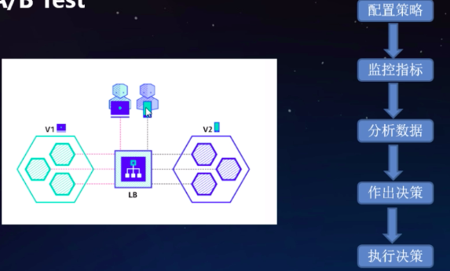

图中是对PC端的用户访问v1版本，手机端用户访问v2版本。可以先配置策略，然后监控两个版本的指标，在分析数据，统计概念在里面，然后在做出决策，最后执行决策。

## Istio流量治理技术解析

那Istio如何做到这些灰度发布的。

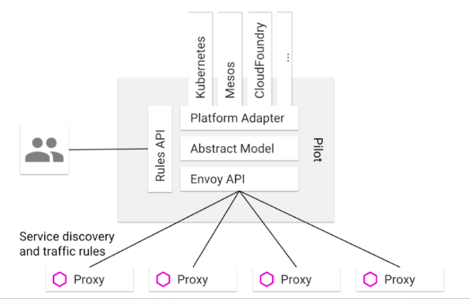

看这张架构图来说明：主要流量是有Poilt来管理，Poilt在整个Istio架构中处在一个大脑的位置，它是管理我们策略配置的中心，用户可以通过开发策略的API `Rlues API`来配置这些策略，	然后Poilt把这些规则转换成自己的 语言模型，再转化成Envoy认识的API 再分发给下面每个工作的`sidecar`。

分发的内容主要包括两部分，一部分是和平台相关的服务发现、cluster、Endpoint通信网络   相关的信息。

第二部分就是路由信息，VirtualService、DestinationRule ServiceEntry这类信息。

Poilt比较强大的地方Platform Adapter适配器，可以对接服务发现相关的平台，比如Kubernetes Mesos。

### 规则配置

和灰度发布相关的主要是VirtualService、DestinationRule，

+ VirtualService在Istio服务网格中定义路由规则，控制路由如何路由到服务上。
+ DestinationRule是VirtualService路由生效后配置应有与请求的策略集。
+ ServiceEntry是通常用于在Istio服务网格之外启用对服务的请求。
+ Gateway为HTTP/TCP 流量配置负载均衡器，最常见的是网格的边缘的操作，以启用应用程序的入口流量。

#### DestinationRule

DestinationRule所定义的策略，决定了经过路由处理之后的流量的访问策略。

+ host——对象服务，作用于哪一个服务。
+ trafficPolicy——流量策略主要配置负载均衡、连接池配置，服务最大连接数，和熔断配置就是超出了你最大的请求数我们要采取什么措施。比如说后端要被移除多长时间。
+ Subsets —— 定义服务的版本

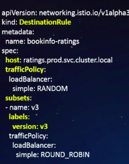

### VirtualService

VirtualService定义了一系列针对指定服务的流量路由规则。

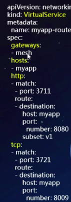

+ Host —— 流量的目标主机，她不像DestinationRule的host只能配着一个，VirtualService的host可以配置多个访问的服务。也就是VirtualService定义的流量规则作用于很多的服务。也就是VirtualService的由原来虚拟Service。可以把一些Service捆绑在一块。

+ Gateways ——  Gateway名称列表， 从外面访问我们的service要经过我们的Gateway，没有这个字段默认是match，就是对网格里面的`sidecar`都生效。

+ http —— 流量规则配置 (HTTPRoute)的列表，也是一个数组。两个点一个匹配到规则是什么，匹配到我采取的动作是什么。

  下面图中的httpMatchRequest是路由规则比如uri,headers,port,method。

  DestinatiinWeight 路由后的分发权重，另外还有重定向，重写，超时，重试等等

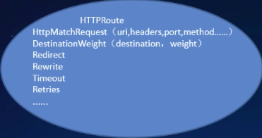

+ Tcp —— tcp流量规则配置 (TCPRoute)的列表。和http一样只是他的规则少一些因为他是四层代理。他可以根据destinationSubnets,port showlabel路由。路由到只有一些权重的规则DestinatiinWeight

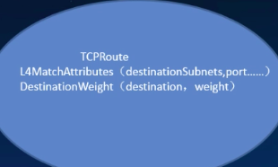

+ tls—— tls和https(TLSRoute)流量规则的列表。

#### VirtualService例子

+ 基于权重的路由

给v1分配20%流量，给v2分配80%流量

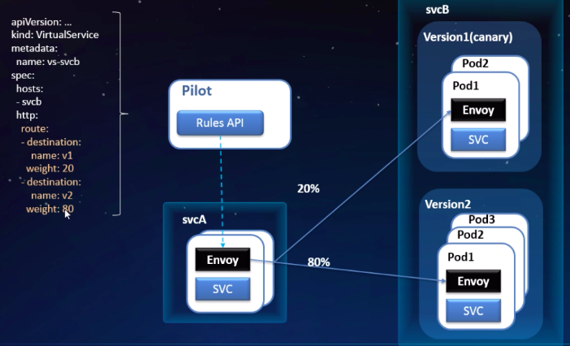

+ 基于请求内容的路由

如果请求头cookie里面带group=dev 我们会把它分配到v1版本，如果其他默认分配到v2版本。

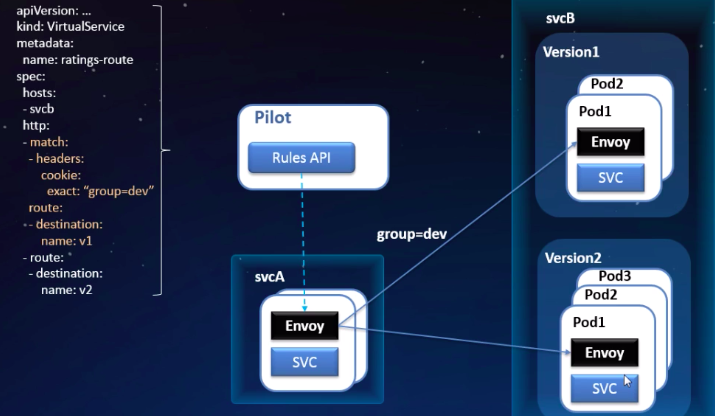

+ 复杂灰度场景下的VirtualService

对于特定用户路由的分发，对于特定网站访问的用户信息，基于一个权重的路由，访问特定网站50%流量导入v1版本，另外50%到v2版本。其他默认导入v1。

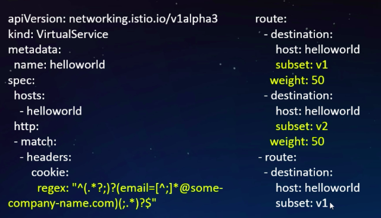

## 智能灰度发布介绍

### 灰度版本的存在形式

Istio的版本模型和k8s版本模型如何对应的。

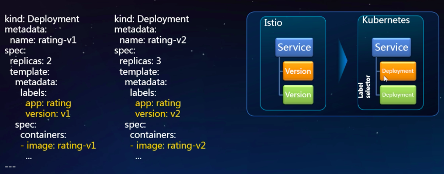

Istio由不同版本，在底层k8s实现 是由Service然后里面对应多个deployment实现，每个版本由一个deployment实现。版本是通过大label实现的

### 灰度发布流程

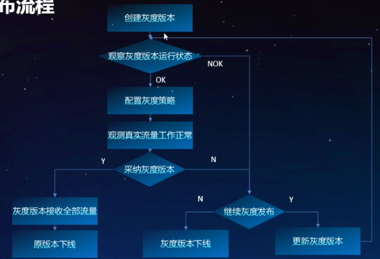

首先创建灰度发布版本，然后观测灰度发布的运行状态cpu内存是否正常，版本状态，正常的话配置灰度策略，配置策略之后根据请求内容导流到特定用户。在通过我们关心的指标去观测两个不同版本所呈现的状态。如果状态OK就采纳灰度版本，让灰度版本接受全部流量，把原版本下线。如果觉得版本有问题 ，我们可以更新灰度发布的版本再来一次灰度发布流程。如果宣布是吧就把灰度版本下线。

### 智能灰度发布

目标：细粒度控制自动化的持续交付。

特点

+ 根据用户细分特定版本导流

+ 流量管理

+ 关键指标可观测，比如应用的请求数量，错误率，迟延，都是可以通过图形化来观测到。

+ 发布流程的自动化

  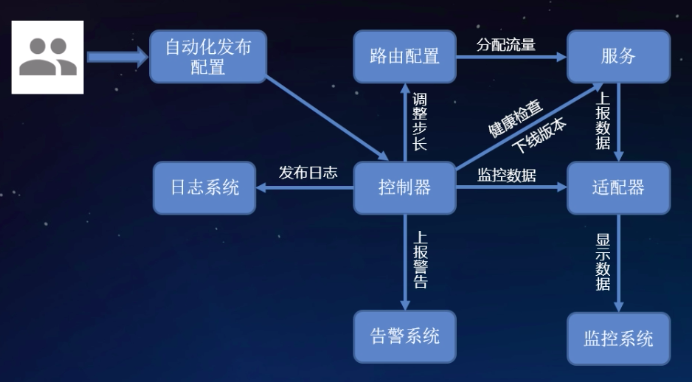

运维人员定义一个系统期望怎么去发布我们的软件做一个自动化的配置(配置需要入参下面说。)，然后配置下发到智能灰度发布控制器里面，控制器根据配置检查服务是否正常，正常的话会去配置路由。

路由配置完作用与我们的服务，在然后分配流量分配到不同的版本，然后不同版本上报数据适配器。

控制器实时监控适配器和版本服务的健康并作出决策，根据我们预先配置的策略，由控制器调整路由的权重。而不是由人来操作。慢慢调整步长，在作用于我们的服务。

如果有问题由控制器终止这次发布。	没问题的话就下线我们的原版本。有问题就回滚。适配器还可以把数据显示到监控系统，可以看到灰度发布指标的回放。

还有一些发布过程中的报警比如发布失败发布成功这些事件上报给我们的告警系统。比如说给你发邮件短信。

还有发布过程的日志，放到日志系统。

#### 自适应发布参数

+ 负载健康状态    —— cpu 内存 健康状态
+ 请求的成功率     ——
+ 平均请求时延
+ 流量权重步长
+ 回滚门限值——每次出现错误，错误累计多少次判定发布失败然后回滚、

#### 健康指标

RED

请求数量、错误率、错误次数、时延

USE

跟应用的性能相关，健康程度，cpu 内存使用率网络IO，能列出这些指标说明在健康监控方面是一个健康比较完备的系统。

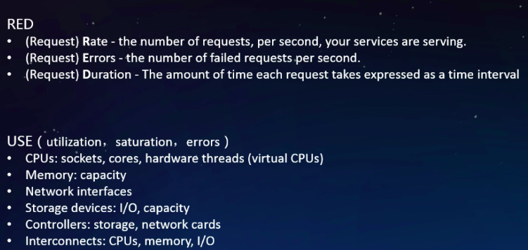

### 开源灰度发布项目

##### Flagger

是基于Istio Prometheus和k8s的控制器

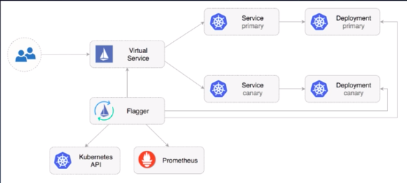

是把配置放到一个叫canary的crd，可以参考crd。

下面可以看出他是逐渐调整自己的步长，实现一个灰度的效果。

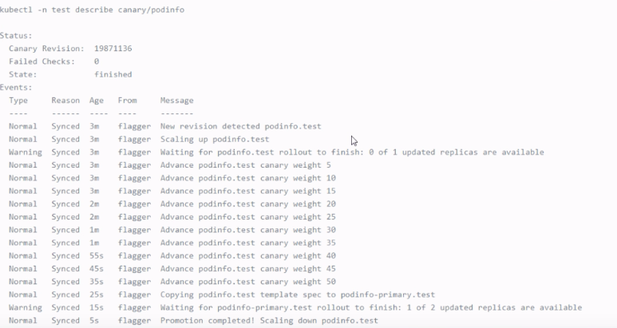

## 灰度发布功能展示Demo

创建一个应用testapp,组件是使用tomcat,然后是v7版本一个实例数。

访问一下，7.0版本

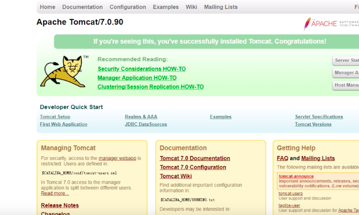

现在我们要另一个版本的发布，版本是v8 镜像版本8.0

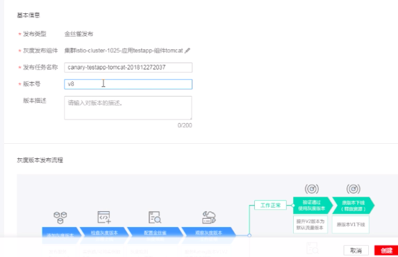

**访问规则策略**

配置访问方式，做一个流量 分发规则规则是：windiws系统 chrome浏览器访问的话是v8版本。 

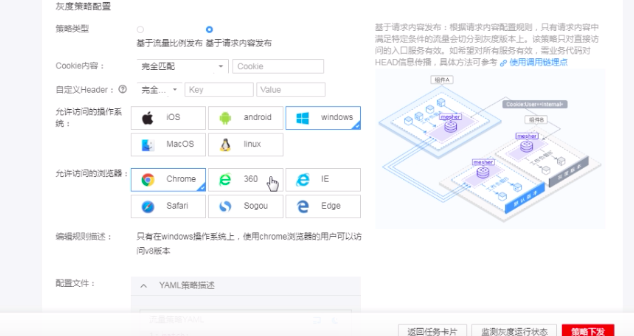

chrome浏览器访问是v8版本

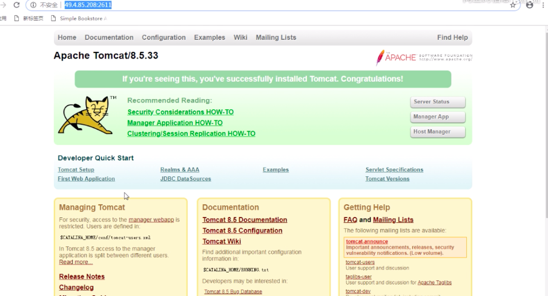

再用IE访问是一个v7的版本

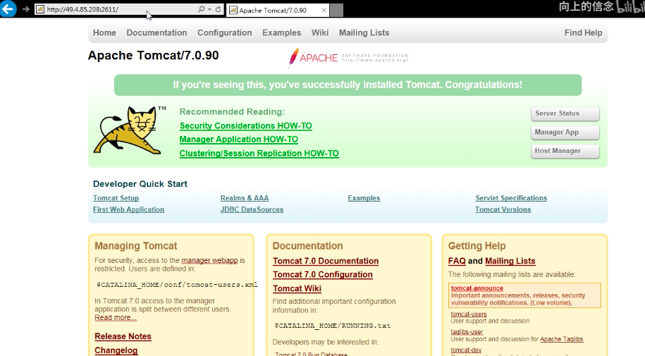

**权重策略**

我们换个灰度策略权重策略，v820%流量v780%流量

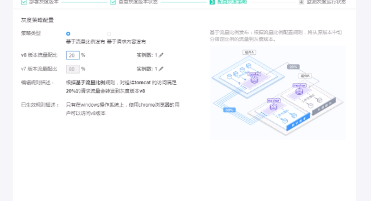

访问大多数到了v7少数到v8

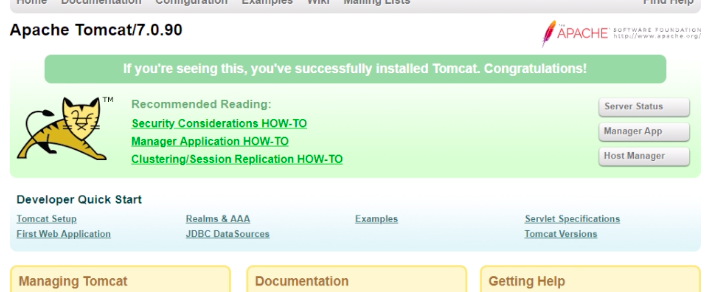

多次访问后可以看到流量占比。这是华为云监测的流量占比

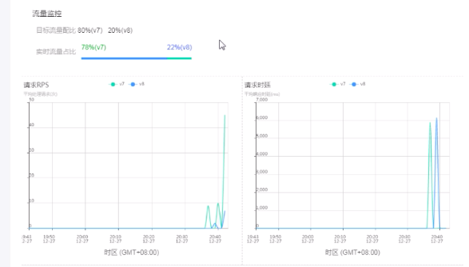

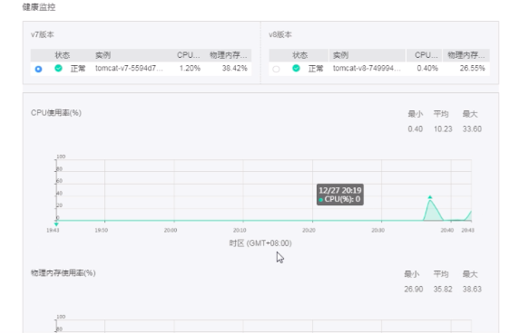

**接管所有流量**

接管所有流量之后可以发现访问的一直是v8版本了。

**下线原版本v7**

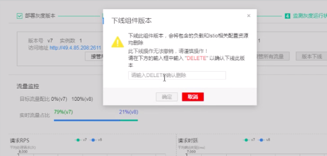

下线之可以看到在历史可以看到发布历史

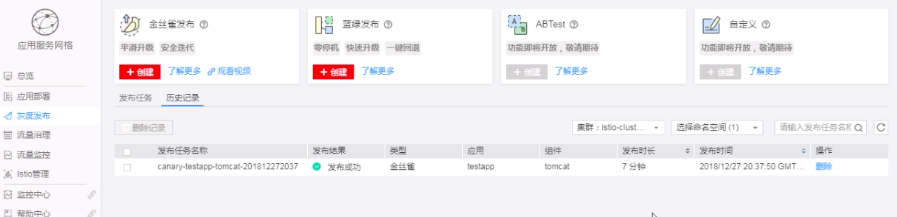
