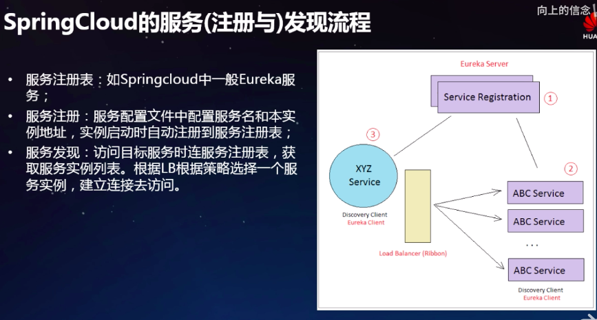

# Istio Pilot 与服务发现

[TOC]

主要点Pilot

Pilot 与“数据面”交互完成服务发现和配置管理的。

## 服务发现

写一个a.app 名字就导入了一个后端但是我们不知道这个后端服务是88还是99。虽然在微服务讲服务发现说的很多，但是这个做微服务的基本手段，如果只是一个单体的应用，或者两个很简单的应用，都可以不用服务发现。

结合springCloud的服务注册发现 XYZ Service 访问ABCservice的时候，ABCservice先把自己的信息放Service Registration，也就是EurekaServer。然后服务调用者 XYZ Service 手里有个Eureka cilent 去Service Registration拿到服务发现的信息，根据负载均衡策略ribbon访问真正的实例。

#### 看图说话 在Istio里面Service A 访问ServiceB 如何做到的

 首先ServiceA 出口流量先被Proxy 拦截掉，Proxy会链接服务发现的地址 Pilot,从上面拿到对应服务发现的数据，就是服务实例的应用关系，同时也会拿到一个负载均衡策略，然后访问ServiceB ，如果ServiceB 有若干个实例，图中有三个实例，根据负载均衡策略访问到对应的ServiceB 副本，当然在访问到ServiceB 的容器的时候是先进入ServiceB 的Proxy。

可以看出无论什么架构的服务发现都几乎一样

Service Mesh服务发现架构特点，因为Service和Proxy在一起的，Proxy会把所访问Service的流量都给他拦截，但是Service本身感知不到Proxy的存在，在访问特别频繁特别密集的时候，提供给这种方式，对服务之间的访问治理是非常有用的，因此也是基于这种思路这种架构设置做它的功能的。

底层实现

Pilot里面有两个东西一个是Abstart Model,另一个是 Platform Adapter,

Abstart Model是存放各种服务信息

Platform Adapter,可以适配各种平台服务发现比如Eureka

### 服务发现的实现

Pilot  里面有个ServiceControllter,这个里面有个Eureka Cilent ,Eureka Cilent 去真正的Eureka Server 服务拿到服务列表	，Discoveryserver维护成服务发现数据，然后通过rpc 接口提供给Envoy使用

>Eureka由于不在维护，在Istio1.0之后的版本Pilot的Eureka Cilent 已经被干掉了

### Istio 结合Kubernetes 做服务发现

结合基于Eureka 的例子，我们可以看出也是通过ServiceControllter通过List/Watch的方式去ApiServer 拿去到服务数据，然后Discoveryserver维护成服务发现数据，然后通过rpc 接口提供给Envoy使用,当访问出口请求的时候根据对应的负载均衡策略选择一个服务实例发起访问。

 

虽然有个platform Adapter 可以适配各种平台但他支持最好的就是kubernets,	看图其实Istio service 就是k8s的service，一个版本把流量导入到另一个版本这样做灰度发布在Istio其实很简单。

K8s 的服务发现也是通过kube-proxy 去apiserver 拿到对应服务列表信息，访问到具体的服务的。K8s 本身也是有服务发现的机制的。

Istio的服务发现其实通过Pilot去k8s的apiserver，然后取的etcd的配置数据，然后  通过Pilot下发到Envoy。从这张图中可以看出k8s和Istio是非常紧密的关系，只要Istio有的功能都是基于k8s构建的。

#### 总结

Pilot 基于提供的Platform Adapter机制做服务发现，可以适配各种不同的后端，当前支持最好的k8s

## 配置管理

在这里Pilot 作为一个规则维护的角色，用户下发规则到Pilot ,然后通过Proxy根据规则，图中的例子说灰度发布一个场景，99% 流量到v1.5版本，1%到v2.0版本，是在服务发起方就决定的这个规则调用，而不服务访问方。

## 流量规则

+ VirtualService
+ DestinationRule
+ ServiceEntry
+ Gateway

###  VirtualService

VirtualService 其实就是一个Service，一个调用方满足什么样的条件，就路由到对应服务版本。满足什么样的条件去什么地方。包括在这个过程中进行服务的一下治理包括重写重试，故障注入等。

VirtualService 支持三种协议 http 七层协议控制东西更多，tls ,tcp。

VirtualService 流量规则： 

   - match   
   -  route
   - Redirect
   - Timeout
   - Rearies
   - Fault
   - Mirror

VirtualService做到工作就是一个服务怎么被访问，访问规则。满足条件访问什么样的服务，访问的时候做一些控制。

### DestinationRule

DestinationRule 目标规则

服务治理：负载均衡，熔断容错，目标流量管理，最大连接等等，非常广泛

DestinationRule 是对目标配置一定规则，比如负载均衡策略

关键字`TrafficPolicy` 流量策略里面有很多定义比如loadBalancer connectionPool数据库连接数 outlierDetectio异常链检查 tls配置等，比如我但是我的服务访问过大配置一个最大连接数，担心服务出现故障配置一个重试机制，配置一个超时机制，等等保证我的服务不会被请求太多，而请求挂掉这些东西都是定义在DestinationRule。

它还可以对pod定义一些规则

DestinationRule配合VirtualService可以把服务治理放大最大化。一个服务怎么被访问一个服务怎么去治理怎么去控制有一个完整的描述。	这个东西不应该叫配置更应该叫描述文件。

### ServiceEntry && Gateway

ServiceEntry

打个比方一个服务访问ServiceMesh外面的服务，假设这个服务他不在集群中，肯定不能注册的，比如访问外面的mysql	,mysql不一定在哪里装着只有一个地址，但是mysql 访问我也想做一些服务治理，就像访问内部服务一样。比如看一下为什么访问慢，可以把它调用链加到ServiceEntry，ServiceEntry就可以把它加入到服务发现中了，就可以进行治理了。	 

Gateway 

功能就是类似于Ingress nginx 服务暴露，也就是说可以把ServiceMesh的服务发布成外部一个可以访问的服务。

## 规则下发流程

在k8s 里面如何下发规则进行治理的。

**流程：**

用户通过kubectl 调用ApiServer进行配置一些crd(资源规则)比如VirtualService、DestinationRule等，把这些规则写入到etcd ,然后Pilot里面有个ConfigController他一直list-watch这些资源对象拿到之后, 然后RPC 服务DiscoverServer去取到资源数据，转换成Envoy能识别的规则，Envoy拿到这个规则进行服务治理。

## 规则定义

在Istio的定规则是长左边这样，在Envoy就长右边这样。如下图：

满足这样条件走v2其他走v1，

Envoy通过Istio定义的描述转成自己的描述，但是Envoy自己也有自己的规则描述

## 规则执行位置

大部分规则都是配置在服务提供方的，而规则的执行都是服务发起方

## Kubernetes & IS stio结合

微服务运行在容器里面而编排工具是k8s已经是业界的标准，而微服务治理使用Istio。

## 服务发现 Istio 比较Spring cloud

1. Istio基于k8s的数据 来做的，这样它里面的数据跟k8s都是一致的。

2. 治理规则：治理规则基于k8s,无需专门的配置服务器管理服务，

而spring cloud必须要有配置中心模块，不在乎配置长什么样，只要往里写，就可以对接后端存放下来，提供通道，把config刷到SDK上面，而在IStio里面这些工作都不需要做，只要一个配置其他东西都有了，0工作量。跟k8s一样只要定一个规则配置yaml就可以。	

3. 服务发现的方式：无需专门服务注册，他是取k8s server的服务数据

比较

1. 服务注册：首先必须要做注册服务器，微服务起来必须连接服务注册中心(Eureka),把自己的地址汇报上去。
2. 服务发现方式：每个服务必须要写服务的注册地址，获取到要连接服务信息地址。注册的时候写把服务注册到哪里，服务发现的时候就要写从哪里连接地址。拿下来做服务发现，然后做访问。
3. 致命问题：服务发现不一致：springcloud的服务注册中心(Eureka)和k8s apiserver是两个服务发现的通道，Eureka在k8s 完全不用，而是用自己的。k8s容器化部署后服务比较轻量，但是运行服务的节点会经常变的，也就是我们常说的漂移，如果死掉就会重新调度，说不定就调度到别的节点上去。这样服务的IP就变了，但是出现这种情况注册中心的地址并没有更新新地址，还是老地址，导致服务访问对应服务的时候就是访问的老地址。就访问不同了。
4. 治理规则：治理规则和服务注册一起，获取单独的配置服务

