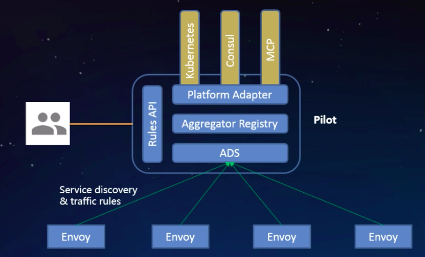
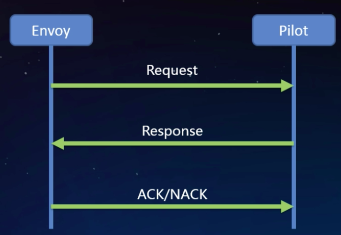
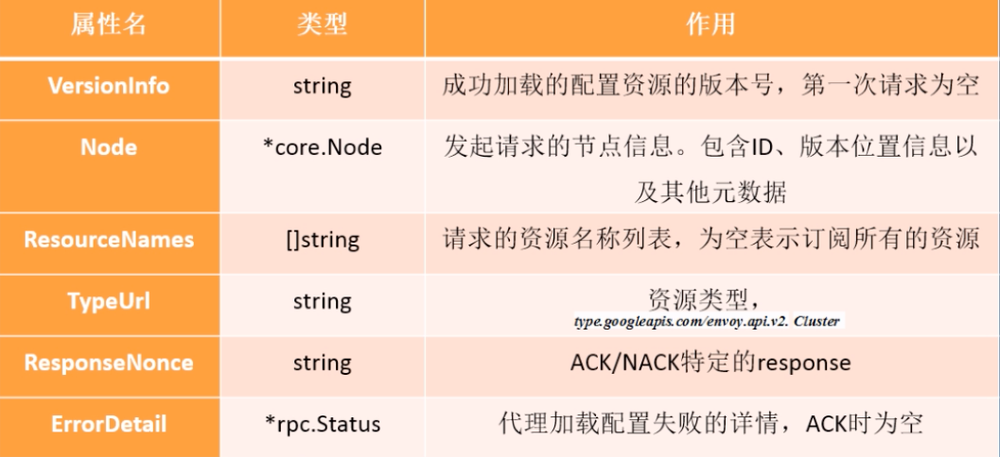
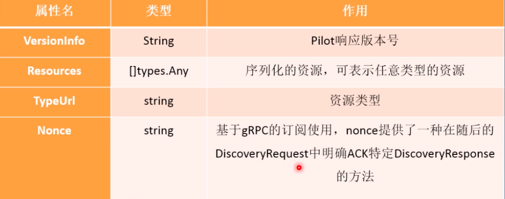
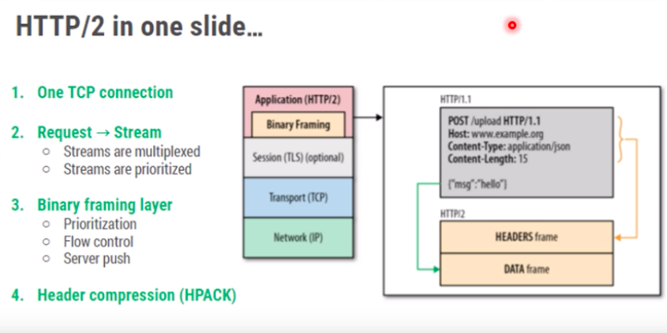
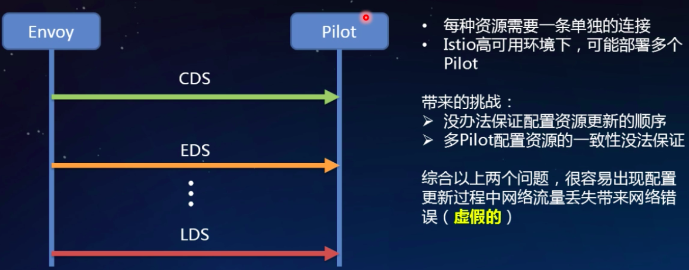

# xDS协议解析

## xDS 基本概念

xDS 是`sidecar`和Pilot 之间传输的应用协议，基于gRPC。

### Istio 服务发现模型

这里讲的是Pilot和`sidecar`之间的配置以及Service discovery (service Endpoints)。

>Istio1.1新加入MCP服务发现

Platorm Adapter 进行服务发现之后，通过Aggreagtor Regitstry 聚合层来提供抽象的接口，供XDS 的server使用，Istio0.8之后XDS server的实现方式是ADS(Aggreagtor discovery service) 实现。

XDS server和`sidecar`之间是走的XDS协议，XDS是为了支持配置而定义的一种协议。

### xDS是什么

xDS 是一发现服务的总称，包含LDS，RDS，CDS，EDS以及SDS。Envoy 通过xDS API 可以动态获取Listener(监听器)，Route(路由)，Cluster(集群)，Endpoint(集群成员)以及Secret(秘钥)配置。

+ LDS

  LDS是Listener发现服务。Listener监听器控制Envoy启动端口监听（目前只支持TCP协议），并配L3/L4层过滤器，当网络连接达到后，配置好的网络过滤器堆栈开始处理后续事件。这种通过监听器体系结构用于执行大多数不同的代理任务(限流，客户端认证，HTTP连接管理，TCP代理等)。

+ RDS

  Route发现服务，用于HTTP连接管理过滤器动态获取路由配置路由配置包含HTTP头部修改（增加、删除HTTP头部键值），virtual hosts （虚拟机），以及virtual hosts定义的各个路由条目。

+ CDS

  Cluster发现服务，用于动态获取Cluster信息。Envoy cluster管理器管理着所有的上游cluster。鉴于上游Cluster或者主机可用于任何代理转发任务，所有上游Cluster一般从Listener或者Route中抽象出来。

+ EDS

  Endpoint发现服务。在Envoy 术语中，Cluster成员就叫Endpoint，对于每个CLuster，Envoy通过EDS API动态获取Endpoint。EDS作为首选服务发现的原因有两点：

  + 于通过DNS解析的负载均衡器进行路由相比，Envoy能明确的知道每个上游主机的信息，因而可以做出更加智能的负载均策略。
  + Endpoint配置包含负载均衡权重、可用域等附加主机属性，这些属性可用于服务网格负载均衡，统计收集等过程中。

+ SDS

  Secret发现服务，用于运行时动态获取TLS证书。ruo没有SDS特性，在k8s环境中必须创建包含证书的Secret，代理启动前Secret必须挂载到sidecar容器中，如果证书过期，则需要重新部署。使用SDS，集中式的SDS服务器将证书分发给所有的Envoy实例，如果证书过期，服务器会将新证书分发，Envoy接收到新的证书后重新加载儿不用重新部署。SDS基于k8swatch（订阅）获取Secret

### 标准xDS流程

Envoy 发起请求到Pilot （xds server），Pilot （xds server）根据请求返回一个Response的响应，Envoy收到响应，动态加载响应里面的配置，根据加载的配置进行ACK/NACK （类型与TCP的三次握手）这个时候只是生产一些me

这里的Request就是指`DiscoveryRequest`，Response是指`DiscoveryResponse`。

## xDS 协议分析

### XDS 协议

xDS 协议是Envoy获取配置信息的传输协议，也是Istio与Envoy连接的桥梁。

Envoy动态的发现服务以及相关资源的API就是指xDS。xDS可以通过两种方式承载：gRPC、REST，这两种方式都是通过xDS-API发送`DiscoveryRequest`请求，然后资源通过`DiscoveryRequest`下发。

### DiscoveryRequest

`DiscoveryRequest`是一个 结构化的东西。可以想象成他就是一个接口。下面是包含的字段

### DiscoveryResponse

## ADS 理解

### What is ADS

ADS 是一种xDS的实现，它基于gRPC长连接。gRPC的实现承载在HTTP/2之上。

HTTP/2是基于同一个连接进行多路复用，可以HTTP/2 connection连接之上同时发送多个request和response。

使用gRPC因为他是一种长连接。

### 为什么引入ADS

Istio0.8以前，Pilot提供的是单一资源的DS 。

比如CDS 和EDS请求Pilot是通过两个不同connection连接 去请求的，也就是说XDS 有几种资源就需要创建几条单独的连接。

**问题**

没办法保证配置资源更新顺序

在生产中需要部署多个Pilot来保证高可用，多个连接可以能会连接到多个Pilot，这样就没有办法保证配置资源的更新，比如LDS连接到Pilot1 ，CDS连接到Pilot2，EDS连接到Pilot3，那么不同资源的动态获取资源的顺序无法保证的。有办法保证也需要耗费很大的代价。

多个Pilot配置资源的一致性没办法保证

在分布式系统中多实例强一致性比较难保证。Pilot也没有提供这种机制，Pilot是一种无状态的应用，如果要保证强一致性必须要通过有状态的方式去实现，多个Pilot还需要定义一种新的协议，需要同步Pilot节点之间的状态。Pilot实例之间的状态，增加Pilot很大的负担。 

综合上面两个问题，就很容易出现配置更新过程中网络流量丢失带来网络错误（虚假的）404、503 。没办法保证配置更新过程，没办法保证配置加载的过程就很容易出现404、503 是很常见的。404、503 并不是真正的错误，他是服务扩容和缩蓉带来的临时性的网络错误。其实不是真的，是一种虚假的状态。

### 为什么ADS可以解决这种问题

ADS允许通过一条连接（gRPC的同一stream）,发送多种资源的请求和响应。

+ 能够保证请求一定落在同一Pilot上，解决多个管理服务器配置不一致的问题。
+ 通过顺序的配置分发，轻松解决资源更新顺序的问题。

ADS最终一致性的考量

xDS 是一种最终一致的协议，所以在配置更新过程中流量会丢失。EDS还没有来得例如，如果通过CDS/EDS获取Cluster X配置，一条指向Cluster X 的RouteConfigutation刚好调整为指向Cluster Y，但是在CDS/以下发Cluster Y的配置的条件下，到Y的流量会全部被丢弃，并且返回给客户端状态码503。

在某些场景下，流量丢弃是不可接受的。Istio通过遵循make before break 模型，调整配置更新顺序可以完全避免流量丢失。

>make before break  :断开之前先要合并，电路的术语 断开一个开关之前先打开另一个开关。

配置更新的顺序

## xDS的未来

Istio目前是全量的向sidecar分发配置，由此带来几个问题

+ 配置更新频率高，大集群的服务，实力数目多，其中有一个更新后便会触发全量的的配置推送到所有的sidecar。带宽占用大，Pilot端cpu利用率高
+ Sidecar占用内存多，随着集群规模增大，配置资源呈指数级增长，极大的限制了服务网格的规模
+ 频繁的配置加载影响sidecar性能稳定性

当前Istio xDS的弊端大大限制了Istio服务网格的规模，如何解决？

1. Sidecar 按需要请求资源，懒加载的方式，当真正的需要流量转发的时候，再去获取路由等配置
2. 定义worklad的服务依赖，例如工作负载A可以访问ns1/serviceB
3. 定义配置规则、Service的NetworkScope，例如服务A只能被同一个Namespace的workload访问。

>通过懒加载的方式官方的并不是很提倡，因为运行时加载。担忧Mixer是一种runtime方式记录metrics 、police这些，在增加一个runtime的懒加载方式其实对Istio的Listener性能损耗比较大，当Pilot挂掉的时候，或者是连接不了的时候，我们的懒加载就会造成真正的流量丢失。转发流量的时候请求会失败。

增量xDS 

Incremental xDS 是一个独立的XDS endpoint，是一种runtime的动态获取配置方案，用于增量的更新xDS客户端订阅的资源，适用于ADS，CDS和RDS：

+ 保证Envoy按需/懒请求需要的资源。例如当流量路由到未知的cluster时，Envoy就会请求获取未知的Cluster信息。
+ 支持大规模可扩展的目标。例如在一个有100k个服务实例的集群中如果一个服务实例有更新，管理服务器只需要下发一个Cluster的信息。

缺点

Incremental xDS 
