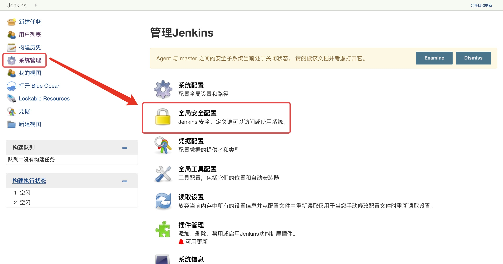
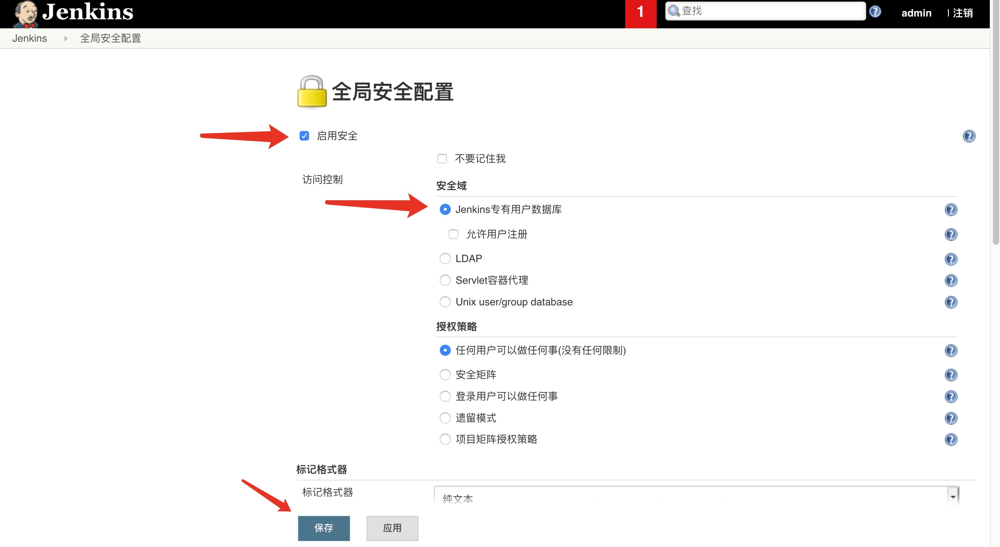
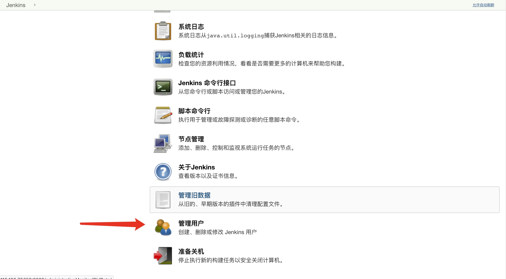
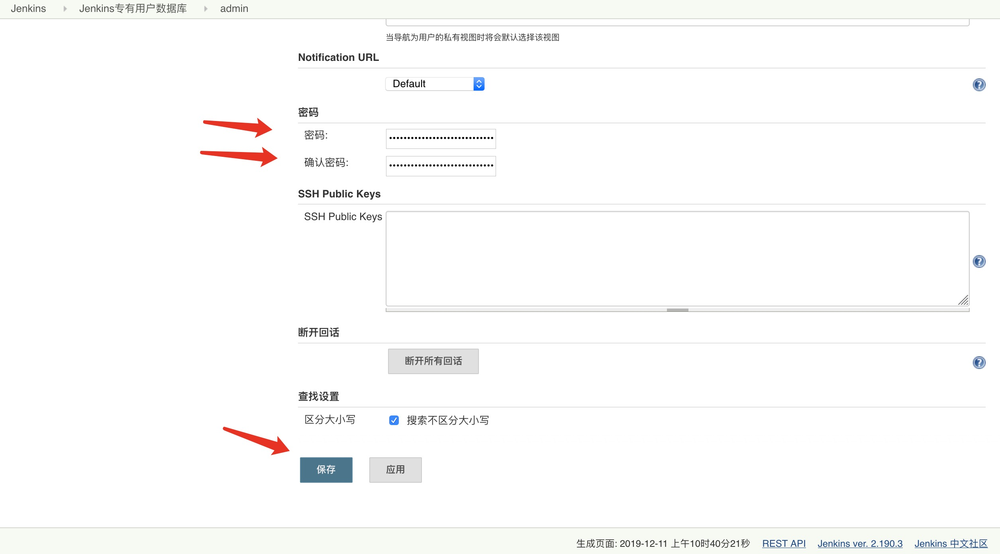

# 安装Jenkins

## 拉取镜像

```
docker pull jenkins/jenkins:lts
```

## 创建命令

```shell
docker run -itd \
-u root \
-p 8888:8080 \
-p 50000:50000 \
--name jenkins \
--privileged=true \
-v /var/run/docker.sock:/var/run/docker.sock \
-v /docker/jenkins/home:/var/jenkins_home \
# -v /docker/jenkins/home/repository/:/var/jenkins_home/repository/ \
-v /usr/bin/docker:/usr/bin/docker \
docker.io/jenkins/jenkins:lts
```

## 启动镜像	

```shell
docker start jenkins
```

若提示权限不足

```shell
sudo chown -R 1000:1000 /docker/jenkins
```

## 查看密码

```shell
（初次启动可查看启动日志）
进入docker内部
进入：docker exec -it jenkins /bin/bash
退出: exit

docker exec -it jenkins /bin/bash
cat /var/jenkins_home/secrets/initialAdminPassword

密码：058adfb17b254832a9fa4b1bf8ec60c0
```

### 实例离线链接

解决方案

```
https://blog.csdn.net/daerzei/article/details/82665198
```

访问链接

```
http://192.168.200.133:8889/pluginManager/advanced
```

设置代理

```
修改：https://updates.jenkins.io/update-center.json
改为：http://updates.jenkins.io/update-center.json
请点击提交按钮
```

## 问题

### 管理员密码忘记

删除Jenkins目录下config.xml文件中下面代码，并保存文件

```shell
 <useSecurity>true</useSecurity>
  <authorizationStrategy class="hudson.security.FullControlOnceLoggedInAuthorizationStrategy">
    <denyAnonymousReadAccess>true</denyAnonymousReadAccess>
  </authorizationStrategy>
  <securityRealm class="hudson.security.HudsonPrivateSecurityRealm">
    <disableSignup>true</disableSignup>
    <enableCaptcha>false</enableCaptcha>
  </securityRealm>
```


### 







